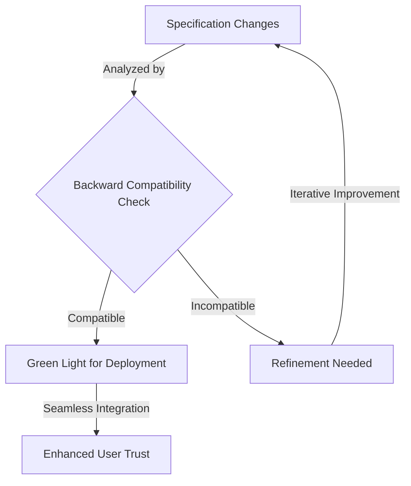
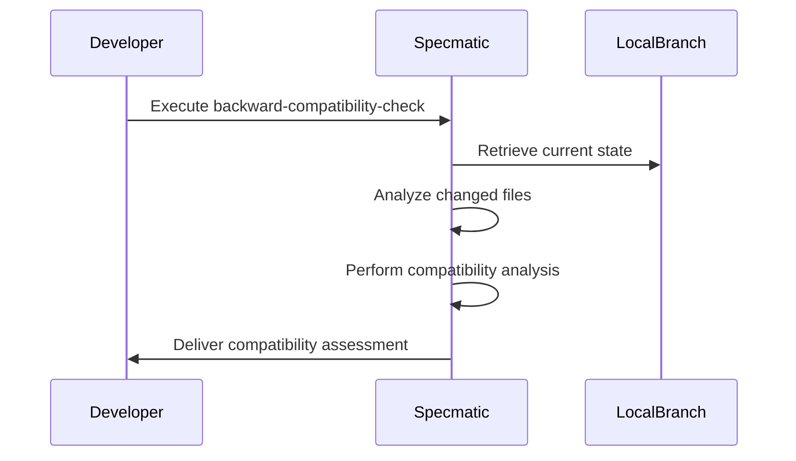
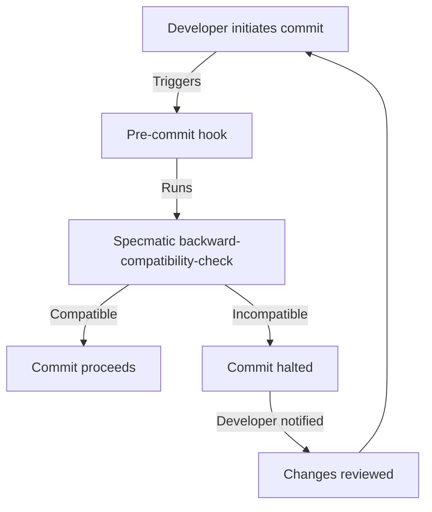
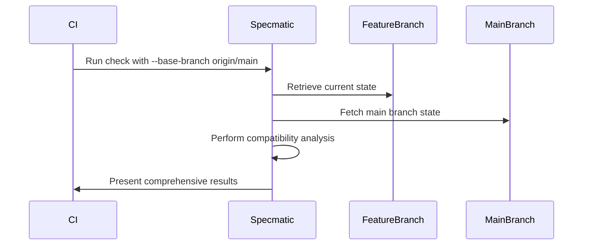
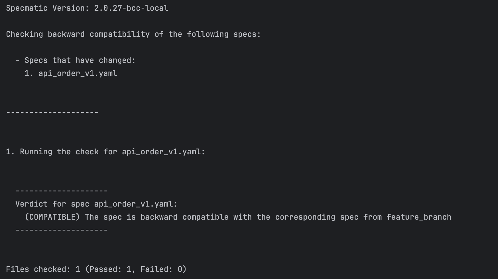
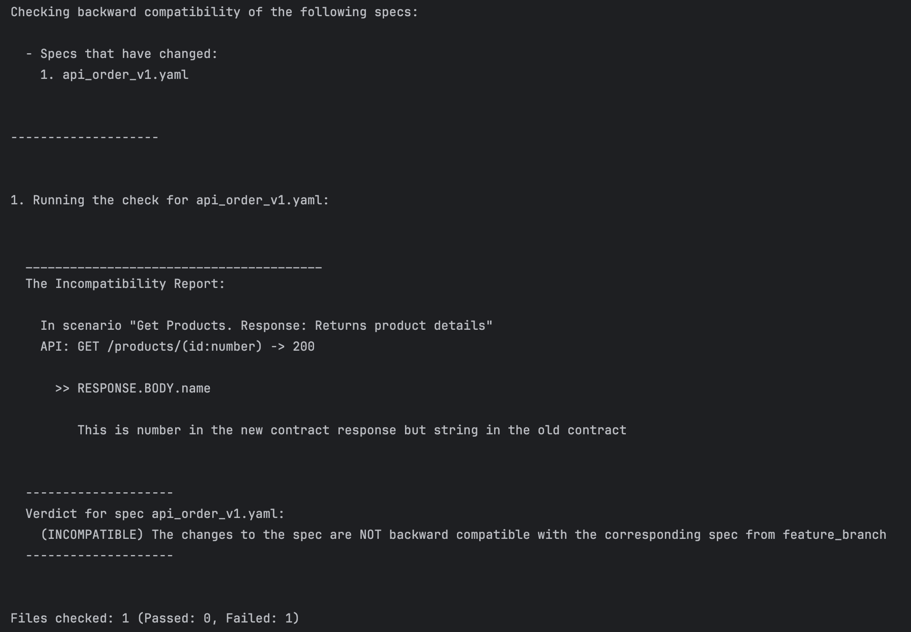

Backward Compatibility
==========


- [Backward Compatibility](#backward-compatibility)
- [Why Backward Compatibility Matters](#why-backward-compatibility-matters)
- [What's New](#whats-new)
- [How it works](#how-it-works)
- [Using Backward Compatibility](#using-backward-compatibility)
  - [Command Essentials](#command-essentials)
    - [Key Options](#key-options)
  - [Common Use Cases](#common-use-cases)
    - [1. Validating Work in Progress (local development)](#1-validating-work-in-progress-local-development)
    - [2. As a pre-commit hook](#2-as-a-pre-commit-hook)
    - [3. Pre-Merge Validation (in your CI pipeline)](#3-pre-merge-validation-in-your-ci-pipeline)
    - [4. Analyzing specific files](#4-analyzing-specific-files)
    - [5. Comparing with a different branch](#5-comparing-with-a-different-branch)
  - [Practical Examples (Try it yourself)](#practical-examples-try-it-yourself)
    - [Orders API Evolution](#orders-api-evolution)
    - [Breaking Change](#breaking-change)
  - [Handling Changes In Progress](#handling-changes-in-progress)
  - [Backward Compatibility Rules](#backward-compatibility-rules)
- [Backward Compatibility Commands (Deprecated)](#backward-compatibility-commands-deprecated)
  - [Comparing Two Contracts (Deprecated)](#comparing-two-contracts-deprecated)
  - [Validating Changes In Git On Your Laptop (Deprecated)](#validating-changes-in-git-on-your-laptop-deprecated)
  - [Validating Changes In CI (Deprecated)](#validating-changes-in-ci-deprecated)
  - [Troubleshooting](#troubleshooting)


# Why Backward Compatibility Matters
Backward compatibility ensures that updates to your API specifications don't accidentally break compatibility. and prevents rework. Perform automated backward compatibility checks to ensure we are not accidentally breaking compatibility.

Specmatic offers this powerful feature to check for backward compatibility between different versions of your API specifications.

- **Catch issues early:** Detect compatibility problems before any code is written
- **Specification-Based Analysis:** By comparing the old and new versions of your API specification, Specmatic provides instant feedback on potential breaking changes.
- **Shift-Left Testing:** Detect breaking changes during API design phase, reduce costly downstream fixes and client disruptions.


In the following sections, we'll show you how to use Specmatic to maintain backward compatibility in your microservices & microfrontend development process.

# What's New
The new command has been overhauled to be more intuitive and supports a wider range of specifications. It now includes:
- Comprehensive support for OpenAPI, gRPC, and GraphQL.
- Simplified usage with smarter messages to help.

> **Note:** [Older commands](#backward-compatibility-commands-deprecated) for backward compatibility will be deprecated soon. We recommend switching to the new command to make the most of its improved capabilities.

# How it works

Specmatic integrates backward compatibility checks into both:
- **Local changes**, to catch issues as you update the specifications.
- **CI pipelines**, ensuring every change is validated before it reaches production.

Here’s a high-level overview of the workflow:



# Using Backward Compatibility

## Command Essentials

To check for backward compatibility of your API specifications, use:

```shell
specmatic backward-compatibility-check [options]
```

### Key Options

- `--target-path`: Focus your analysis on specific file or folder. Default is all files and folder.
- `--base-branch`: Select your comparison base. This defaults to head of the current branch.
- `--repo-dir`: Specify the directory where the repository is located. Default is the current directory.

## Common Use Cases

### 1. Validating Work in Progress (local development)

For immediate feedback on your uncommitted changes:

```shell
specmatic backward-compatibility-check
```



### 2. As a pre-commit hook

Add to .git/hooks/pre-commit. This makes sure backward compatibility is always checked before commit, even if you don't do it manually.

```shell
#!/bin/sh
specmatic backward-compatibility-check
```



### 3. Pre-Merge Validation (in your CI pipeline)

Ensure your changes align with the main project direction:

```shell
specmatic backward-compatibility-check --base-branch origin/main
```



### 4. Analyzing specific files

```shell
specmatic backward-compatibility-check --target-path ./api/products.yaml
```

### 5. Comparing with a different branch

```shell
specmatic backward-compatibility-check --base-branch origin/feature_v2
```

### 6. Analyzing a specific directory

```shell
specmatic backward-compatibility-check --repo-dir /path/to/repo
```

## Practical Examples (Try it yourself) 

### Orders API Evolution

Consider this initial Orders API specification:

```yaml
# filename: api_products_v1.yaml
openapi: 3.0.0
info:
  title: Sample Product API
  version: 0.1.9
servers:
  - url: http://localhost:8080
    description: Local
  - url: http://localhost:9000
    description: Specmatic Stub Server
paths:
  /products/{id}:
    get:
      summary: Get Products
      description: Fetch product details
      parameters:
        - in: path
          name: id
          schema:
            type: number
          required: true
          description: Product ID
      responses:
        '200':
          description: Returns product details
          content:
            application/json:
              schema:
                type: object
                properties:
                  name:
                    type: string
                  sku:
                    type: string

```

Now, let's evolve this API by adding a new `category` field:

```yaml
# Updated version of api_products_v1.yaml
openapi: 3.0.0
info:
  title: Sample Product API
  version: 0.2.0
paths:
  /products/{id}:
    get:
      summary: Get Products
      description: Fetch product details
      parameters:
        - in: path
          name: id
          schema:
            type: number
          required: true
      responses:
        '200':
          description: Returns product details
          content:
            application/json:
              schema:
                type: object
                properties:
                  name:
                    type: string
                  sku:
                    type: string
                  category:
                    type: string

```

Run the backward compatibility check:

```bash
specmatic backward-compatibility-check --target-path ./api_products_v1.yaml
```

Specmatic will approve this change, as adding an optional field maintains backward compatibility. Here is the sample output of the command



### Breaking Change

However, let's change the data type of name from 'string' to 'number':

```yaml
# Breaking change in api_products_v1.yaml
openapi: 3.0.0
info:
  title: Sample Product API
  version: 0.2.0
paths:
  /products/{id}:
    get:
      summary: Get Products
      description: Fetch product details
      parameters:
        - in: path
          name: id
          schema:
            type: number
          required: true
      responses:
        '200':
          description: Returns product details
          content:
            application/json:
              schema:
                type: object
                properties:
                  name:
                    type: number
                  sku:
                    type: string
                  category:
                    type: string

```

Running the check now:

```bash
specmatic backward-compatibility-check --target-path ./api_products_v1.yaml
```

Specmatic will flag this as incompatible, protecting your API consumers from unexpected changes. Following is the output of the command.



## Handling Changes In Progress

APIs whose design is still in progress can be tagged WIP in the OpenAPI Specifications. Specmatic will not break builds or return failure on when it see backward incompatible changes to WIP APIs. It will still print the error feedback.

```yaml
# filename api_products_v1.yaml
openapi: 3.0.0
info:
  title: Sample Product API
  description: Optional multiline or single-line description in [CommonMark](http://commonmark.org/help/) or HTML.
  version: 0.1.9
servers:
  - url: http://localhost:8080
    description: Local
  - url: http://localhost:9000
    description: Specmatic Stub Server
paths:
  /products/{id}:
    get:
      summary: Get Products
      description: Get Products
      tags:
        - "WIP"
      parameters:
        - in: path
          name: id
          schema:
            type: number
          required: true
          description: Numerical Product Id
      responses:
        '200':
          description: Returns Product With Id
          content:
            application/json:
              schema:
                type: object
                required:
                  - name
                properties:
                  name:
                    type: string
                  sku:
                    type: string
  /products:
    post:
      summary: Add Product
      description: Add Product
      requestBody:
        content:
          application/json:
            schema:
              type: object
              required:
                - name
              properties:
                name:
                  type: string
                sku:
                  type: string
                  nullable: true
      responses:
        '200':
          description: Returns Product With Id
          content:
            application/json:
              schema:
                type: object
                required:
                  - id
                properties:
                  id:
                    type: integer
```

Once the specification is complete you can remove the WIP tag.

## Backward Compatibility Rules

Maintaining backward compatibility is about changing the API provider WITHOUT breaking any existing consumer. Consumers should just continue working as-is, without needing to "keep up".

[Read this for more](https://specmatic.in/documentation/backward_compatibility_rules.html).


> [!IMPORTANT]
> All the existing commands for backward compatibility (listed in the following sections) will be phased out in our next major release. We highly recommend transitioning to the more robust [`backward-compatibility-check`](#using-backward-compatibility) command to future-proof your development process.

# Backward Compatibility Commands (Deprecated)

## Comparing Two Contracts (Deprecated)

> **Note:** The following command will be deprecated soon. We recommend switching to the [new command](#using-backward-compatibility) to make the most of its improved capabilities.

Create a file named api_products_v1.yaml.

```yaml
# filename api_products_v1.yaml
openapi: 3.0.0
info:
  title: Sample Product API
  description: Optional multiline or single-line description in [CommonMark](http://commonmark.org/help/) or HTML.
  version: 0.1.9
servers:
  - url: http://localhost:8080
    description: Local
  - url: http://localhost:9000
    description: Specmatic Stub Server
paths:
  /products/{id}:
    get:
      summary: Get Products
      description: Get Products
      parameters:
        - in: path
          name: id
          schema:
            type: number
          required: true
          description: Numerical Product Id
      responses:
        '200':
          description: Returns Product With Id
          content:
            application/json:
              schema:
                type: object
                required:
                  - name
                properties:
                  name:
                    type: string
                  sku:
                    type: string
```

This contract contains an API for fetching the details of a product.

Let's add a new api to create a product record:

```yaml
# filename api_products_v2.yaml
openapi: 3.0.0
info:
  title: Sample Product API
  description: Optional multiline or single-line description in [CommonMark](http://commonmark.org/help/) or HTML.
  version: 0.1.9
servers:
  - url: http://localhost:8080
    description: Local
  - url: http://localhost:9000
    description: Specmatic Stub Server
paths:
  /products/{id}:
    get:
      summary: Get Products
      description: Get Products
      parameters:
        - in: path
          name: id
          schema:
            type: number
          required: true
          description: Numerical Product Id
      responses:
        '200':
          description: Returns Product With Id
          content:
            application/json:
              schema:
                type: object
                required:
                  - name
                properties:
                  name:
                    type: string
                  sku:
                    type: string
  /products:
    post:
      summary: Add Product
      description: Add Product
      requestBody:
        content:
          application/json:
            schema:
              type: object
              required:
                - name
              properties:
                name:
                  type: string
                sku:
                  type: string
                  nullable: true
      responses:
        '200':
          description: Returns Product With Id
          content:
            application/json:
              schema:
                type: object
                required:
                  - id
                properties:
                  id:
                    type: integer
```

The old /products/{id} API remains intact, and the new /products API is added on.

The newer contract is backward compatible with the older, as existing consumers are only using the old API, which remains unchanged.

Run the specmatic compare command to confirm this, and see the result:



```bash
java -jar specmatic.jar compare api_products_v1.yaml api_products_v2.yaml
```


```bash
npx specmatic compare api_products_v1.yaml api_products_v2.yaml
```


```bash
docker run -v "/local-directory:/specs" znsio/specmatic compare "/specs/api_products_v1.yaml" "/specs/api_products_v2.yaml" 
```



You should now see an output as shown below.
```bash
The newer contract is backward compatible
```

Let's change the original contract of square to return `sku` as a num `integer` instead of `string` in the response:

```yaml
# filename api_products_v2.yaml
openapi: 3.0.0
info:
  title: Sample Product API
  description: Optional multiline or single-line description in [CommonMark](http://commonmark.org/help/) or HTML.
  version: 0.1.9
servers:
  - url: http://localhost:8080
    description: Local
  - url: http://localhost:9000
    description: Specmatic Stub Server
paths:
  /products/{id}:
    get:
      summary: Get Products
      description: Get Products
      parameters:
        - in: path
          name: id
          schema:
            type: number
          required: true
          description: Numerical Product Id
      responses:
        '200':
          description: Returns Product With Id
          content:
            application/json:
              schema:
                type: object
                required:
                  - name
                properties:
                  name:
                    type: string
                  sku: #this has changed from string to integer
                    type: integer
```

Now try it again:



```bash
java -jar specmatic.jar compare api_products_v1.yaml api_products_v2.yaml
```


```bash
npx specmaitc compare api_products_v1.yaml api_products_v2.yaml
```


```bash
docker run -v "/local-directory:/specs" znsio/specmatic compare "/specs/api_products_v1.yaml" "/specs/api_products_v2.yaml" 
```



Specmatic will show you an error message, saying that the change is not backward compatible. The reason for this is that existing consumers are expecting a string "sku", but will get an "integer" instead.

```bash
In scenario "Get Products. Response: Returns Product With Id"
API: GET /products/(id:number) -> 200

  >> RESPONSE.BODY.sku

     This is number in the new contract response but string in the old contract

The newer contract is not backward compatible.
```

If the change is not backward compatible, the compare command exits with exit code 1. You can use this in a script.

## Validating Changes In Git On Your Laptop (Deprecated)

> **Note:** The following command will be deprecated soon. We recommend switching to the [new command](#using-backward-compatibility) to make the most of its improved capabilities.

If `api_products_v1.yaml` is part of a git repository, changes can be made directly to this file instead of creating a new one.

Then to confirm that it is a backward compatible change, before committing the change, run this command:



```bash
java -jar specmatic.jar compatible git file ./run/specmatic/examples/api_products_v1.yaml
```


```bash
npx specmatic compatible git file api_products_v1.yaml
```


```bash
docker run -v "/git-repo:/git-repo" znsio/specmatic compatible git file "/git-repo/api_products_v1.yaml"
```



This command exits with exit code 1 if the change is backward incompatible. It can be configured as a git pre-commit hook.

```bash
The newer contract is backward compatible
```

## Validating Changes In CI (Deprecated)

> **Note:** The following command will be deprecated soon. We recommend switching to the [new command](#using-backward-compatibility) to make the most of its improved capabilities.

In CI, you will need to compare the changes in a contract from one commit to the next.

You can do this with the following command:



```bash
java -jar specmatic.jar compatible git commits api_products_v1.yaml HEAD HEAD^1
```


```bash
npx specmatic compatible git commits api_products_v1.yaml HEAD HEAD^1
```


```bash
docker run -v "/git-repo:/git-repo" znsio/specmatic compatible git commits "/git-repo/api_products_v1.yaml" HEAD HEAD^1
```



You can even use commit hashes here if you wish to compare any other pair of commits.

```bash
The newer contract is backward compatible
```

This command exits with exit code 1 if the change is backward incompatible.


## Troubleshooting

1. **Command Not Recognized**: 
   - Verify Specmatic is properly configured for your current directory (either Docker or Node package or Python module or Jar file)
   - Ensure you are using the latest version of Specmatic.

2. **Unexpected Outcomes**: 
   - Confirm the accuracy of file paths and branch names.
   - Review your recent changes for unintended modifications.

3. **Too many changes**: 
   - For large-scale projects, utilize the `--target-path` to focus on specific components.

4. **CI Pipeline Issues**:
  - Ensure your CI environment has the necessary permissions to access all required branches
  - Verify that your CI configuration correctly sets up Specmatic before running the compatibility check
