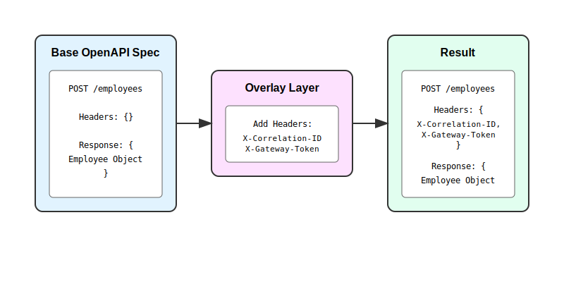
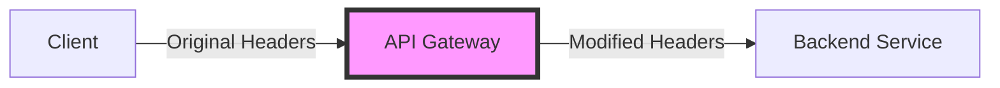

Contract Tests
==============

- [Contract Tests](#contract-tests)
    - [Overview](#overview)
    - [Specmatic Contract Test - Command Line](#specmatic-contract-test---command-line)
    - [How the contract test works (step-by-step)](#how-the-contract-test-works-step-by-step)
    - [Externalising examples / test cases](#externalising-examples--test-cases)
    - [Generating examples](#generating-examples)
    - [Boundary Condition Testing](#boundary-condition-testing)
    - [JUnit Output From The Command](#junit-output-from-the-command)
    - [When The API Does Not Match The API Specification](#when-the-api-does-not-match-the-api-specification)
    - [Declaring Contracts In Configuration](#declaring-contracts-in-configuration)
    - [Handling multipart form-data and file uploads](#handling-multipart-form-data-and-file-uploads)
    - [The Java Helper For Java Projects](#the-java-helper-for-java-projects)
    - [Handling Application authentication](#handling-application-authentication)
    - [Authentication In CI For HTTPS Git Source](#authentication-in-ci-for-https-git-source)
    - [Authentication In CI For SSH Git Source](#authentication-in-ci-for-ssh-git-source)
    - [Examples For WSDL Contracts](#examples-for-wsdl-contracts)
    - [Programmatically executing Specmatic Contract as Tests](#programmatically-executing-specmatic-contract-as-tests)
    - [HTML Report](#html-report)
      - [Summary](#summary)
      - [Coverage Table](#coverage-table)
      - [Remarks](#remarks)
    - [Referring to local specifications](#referring-to-local-specifications)
    - [Examples that are not passing yet](#examples-that-are-not-passing-yet)
    - [Examples that trigger 400 responses](#examples-that-trigger-400-responses)
  - [Selectively Running Tests in CI](#selectively-running-tests-in-ci)
    - [Test Filtering Options](#test-filtering-options)
    - [Using the New Filter System (Recommended)](#using-the-new-filter-system-recommended)
      - [Available Filter Keys](#available-filter-keys)
      - [Available Filter Operations](#available-filter-operations)
      - [Filter Syntax](#filter-syntax)
      - [Excluding Tests](#excluding-tests)
    - [Programmatic Usage](#programmatic-usage)
    - [Examples](#examples)
      - [Common Use Cases](#common-use-cases)
    - [Putting it all together](#putting-it-all-together)
    - [Additional Tips](#additional-tips)
    - [API Coverage](#api-coverage)
      - [Enable the Actuator Mapping Endpoint](#enable-the-actuator-mapping-endpoint)
      - [Use Swagger UI](#use-swagger-ui)
  - [Overlays](#overlays)
    - [Introduction](#introduction)
    - [Understanding with a Real-World Example](#understanding-with-a-real-world-example)
    - [Base Specification](#base-specification)
    - [Overlay Specification](#overlay-specification)
    - [Using Overlays in Specmatic](#using-overlays-in-specmatic)
      - [Step 1: Setting Up Files](#step-1-setting-up-files)
      - [Step 2: Specifying Overlay Files](#step-2-specifying-overlay-files)
      - [Step 3: Understanding the Results](#step-3-understanding-the-results)
    - [Further Reading](#further-reading)
  - [Hooks](#hooks)
    - [Overview](#overview-1)
    - [Real-World Scenarios](#real-world-scenarios)
    - [API Gateway Transformations](#api-gateway-transformations)
    - [Implementation Example](#implementation-example)
      - [Initial Client API Specification](#initial-client-api-specification)
    - [Setting Up Test Hooks](#setting-up-test-hooks)
    - [Sample Project Access](#sample-project-access)
      - [Creating the JAR File](#creating-the-jar-file)
    - [How It Works](#how-it-works)
    - [Conclusion](#conclusion)
  - [Advanced Features](#advanced-features)
    - [Generative Tests](#generative-tests)
    - [Limiting the Count of Tests](#limiting-the-count-of-tests)
    - [Dictionary](#dictionary)
      - [Create the Specification](#create-the-specification)
      - [Create a Dictionary](#create-a-dictionary)
      - [Run the tests Tests](#run-the-tests-tests)
      - [Generative Tests](#generative-tests-1)
    - [Sample Project](#sample-project)

### Overview


As seen in "[getting started](/getting_started.html#provider-side---contract-as-a-test)" Specmatic is able to leverage your API Specifications as "Contract Tests" to verify if your application is adhering the specification. This step is critical in making sure that your application / provider is honouring its side of the contract in the "Contract Driven Development" process just like how consumers build against a smart mock that is based the same OpenAPI Specification.

### Specmatic Contract Test - Command Line

Create a file named "employees.yaml" and copy below content into it. This is an API Specification for an employee service which allows fetching and updating employee details.

```yaml
openapi: 3.0.0
info:
  title: Employees
  version: '1.0'
servers: []
paths:
  '/znsio/specmatic/employees':
    post:
      summary: ''
      requestBody:
        content:
          application/json:
            schema:
              $ref: '#/components/schemas/Employee'
            examples:
              CREATE_EMPLOYEE_SUCCESS:
                value:
                  id: 70
                  name: Jill Doe
                  department: Engineering
                  designation: Director
      responses:
        '201':
          description: Employee Created Response
          content:
            application/json:
              schema:
                $ref: '#/components/schemas/Employee'
              examples:
                CREATE_EMPLOYEE_SUCCESS:
                  value:
                    id: 70
                    name: Jill Doe
                    department: Engineering
                    designation: Director
  '/znsio/specmatic/employees/{id}':
    parameters:
      - schema:
          type: number
        name: id
        in: path
        required: true
        examples:
          FETCH_EMPLOYEE_SUCCESS:
            value: 10
          FETCH_EMPLOYEE_NOT_FOUND_ERROR:
            value: 100
          UPDATE_EMPLOYEE_SUCCESS:
            value: 10
    get:
      summary: Fetch employee details
      tags: []
      responses:
        '200':
          description: Details for employee id in request
          content:
            application/json:
              schema:
                $ref: '#/components/schemas/Employee'
              examples:
                FETCH_EMPLOYEE_SUCCESS:
                  value:
                    id: 10
                    name: Jane Doe
                    department: Engineering
                    designation: Engineering Manager
        '404':
          description: Employee with given id not found
          content:
            application/json:
              schema:
                type: object
                properties: {}
              examples:
                FETCH_EMPLOYEE_NOT_FOUND_ERROR:
                  value: {}
    put:
      summary: ''
      requestBody:
        content:
          application/json:
            schema:
              $ref: '#/components/schemas/Employee'
            examples:
              UPDATE_EMPLOYEE_SUCCESS:
                value:
                  id: 10
                  name: Jill Doe
                  department: Engineering
                  designation: Director
      responses:
        '200':
          description: Updated employee details
          content:
            application/json:
              schema:
                $ref: '#/components/schemas/Employee'
              examples:
                UPDATE_EMPLOYEE_SUCCESS:
                  value:
                    id: 10
                    name: Jill Doe
                    department: Engineering
                    designation: Director
components:
  schemas:
    Employee:
      title: Employee
      type: object
      required:
        - id
        - name
        - department
        - designation
      properties:
        id:
          type: integer
        name:
          type: string
        department:
          type: string
        designation:
          type: string
```

Here is a sample application that is is implementing this specification. You can run a curl command on this URL to see the sample data.

`https://my-json-server.typicode.com/znsio/specmatic-documentation/employees/`

Let us now run the ```employees.yaml``` as a test against the above sample application.

```bash
{{ site.spec_cmd }} test employees.yaml --testBaseURL https://my-json-server.typicode.com
```

Alternatively, we can also run the same command with the Docker image:

```bash
docker run znsio/specmatic test employees.yaml --testBaseURL https://my-json-server.typicode.com
```

The results should end with below text.

```Tests run: 4, Successes: 4, Failures: 0, Errors: 0```

And if you further analyse the test logs for ```PUT /znsio/specmatic/employees/{id}```, you will notice that specmatic sent the value 10 and did not generate a random value. How did this happen?
* Specmatic is able to correlate the request and response examples based on naming convention.
* In the ```employees.yaml``` you will notice several examples for the employeeId parameter each with a different name, these same names are again used in the response examples also. This is what is helping Specmatic tie the request and response together.
* In OpenAPI, while it is possible to define several possible responses for an operation, it is not possible to define which input generates which response. This is the reason why Specmatic has to depend on the example names.

### How the contract test works (step-by-step)

Let's go over how the above contract test works once again.

The purpose of the contract test is to check if the application understands a specification-valid request and returns a specification-valid response.

Let's take the example of `FETCH_EMPLOYEE_SUCCESS` in the above specification.

First, Specmatic's `test` command collects all the examples named `FETCH_EMPLOYEE_SUCCESS` in the `parameters` section of `/znsio/specmatic/employees/{id}` in the above specification, and sends a GET request with these values to `/znsio/specmatic/employees/{id}`. These examples serve as test data for Specmatic. Specmatic expects that the application will understand them and return the expected response.

Needless to say, the application must be setup before the contract tests run to return the required response.

Next, when the application sends back a response, Specmatic must validate it against the specification. But `/znsio/specmatic/employees/{id}` has a `200` and a `404` response in the spec. How does Specmatic know which of the two to expect? Specmatic just looks for a response example named `FETCH_EMPLOYEE_SUCCESS`, and finds it under the `200`. Hence, the response code is expected to be `200`, and the payload must match that defined under the 200 response. Any response from the application with a `200` status code matching the `200` response specification will be accepted by Specmatic.

Thus, the request and response examples named `FETCH_EMPLOYEE_SUCCESS` taken together comprise a contract test named `FETCH_EMPLOYEE_SUCCESS`.

Note that the response example named `FETCH_EMPLOYEE_SUCCESS` is not compared with values returned by the application. This is what sets a Contract Test apart from an API Test. A Contract Test is concerned with checking the APIs signature, while API tests are concerned with checking the APIs logic.

However the response example named `FETCH_EMPLOYEE_SUCCESS` is verified and used in [service virtualization](/documentation/service_virtualization_tutorial.html#examples-as-expectations).

### Externalising examples / test cases

You can store test data in json files side-by-side to be used in the contract test, instead of inline examples.

Let's try it out. Please clone below sample repo.

[https://github.com/znsio/externalised-example-jsons-sample](https://github.com/znsio/externalised-example-jsons-sample)

The [`employees.yaml`](https://github.com/znsio/externalised-example-jsons-sample/blob/main/employees.yaml) file in this repo is similar to the spec we saw in the above section with the difference that it does not include inline examples. Instead all the examples are externalised to JSON files inside a folder named [`employees_examples`](https://github.com/znsio/externalised-example-jsons-sample/tree/main/employees_examples). Please have a look at each of the examples files (which have self explanatory names) to understand the syntax.

Let us now run `employees.yaml` as a test against the sample application.

Here’s how you can present that command with `site.spec_cmd` and the Docker alternative in Bash format:

```bash
{{ site.spec_cmd }} test --testBaseURL https://my-json-server.typicode.com employees.yaml
```

Alternatively, we can also run the same command with the Docker image:

```bash
docker run znsio/specmatic test --testBaseURL https://my-json-server.typicode.com employees.yaml
```

Note: Since the folder is named `employees_examples` and colocated with the spec file `employees.yaml`, by convention it is automatically picked up. However if your folder has different name and / or located in another path, you can explicitly pass that folder as a parameter using the `--examples` CLI Argument (Please run `specmatic test --help` to learn more).

The test results will look as shown below. Specmatic has run one test per external example file at this point. This is quite similar to our earlier test run.

```Tests run: 5, Successes: 5, Failures: 0, Errors: 0```

The complete test data format can be referred to [here](/documentation/test_data_format.html).

### Generating examples

Instead of creating the above example JSONs by hand, you can also generate the example JSONs using the `examples` command:

```bash
java -jar specmatic.jar examples employees.yaml
```

Alternatively, we can also run the same command with the Docker image:

```bash
docker run znsio/specmatic examples employees.yaml
```

In the above case, example JSON files will be written into the directory named `employees_examples`. You can then update the files to suit your needs and use them.

### Boundary Condition Testing

In the above example, we only ran the happy path test cases. What if we send an number to a boolean parameter? What if we send a null to a non-nullable parameter? What if we do not send a mandatory parameter? How does the application handle these errors? Input validation is an important aspect of your api security strategy ([OWASP reference](https://cheatsheetseries.owasp.org/cheatsheets/Input_Validation_Cheat_Sheet.html)).

Specmatic can help you verify / assess such boundary condition behavior and the associated error handling in your application. Let us run the Specmatic tests with the ```SPECMATIC_GENERATIVE_TESTS``` environment variable set to true.

```export SPECMATIC_GENERATIVE_TESTS=true```

```bash
{{ site.spec_cmd }} test --testBaseURL https://my-json-server.typicode.com employees.yaml
```

Alternatively, we can also run the same command with the Docker image:

```bash
docker run znsio/specmatic test --testBaseURL https://my-json-server.typicode.com employees.yaml
```

Earlier for the same input we saw 4 tests and all of which were successful. This time around you will see a total of 26 tests, of which 21 are failures.

```Tests run: 26, Successes: 5, Failures: 21, Errors: 0```

Exercise: Analyse the logs to understand what input validations need to be added to the application.

If you want to start small, set the flag `ONLY_POSITIVE` to true, either as an environment variable or as a Java system property. With this flag switched on, requests with all combinations of properties and values permitted by the spec will be generated and used as tests against your API. However negative tests (e.g. sending a number where boolean is required) will not be run.

Demo: [Video](https://youtu.be/U5Agz-mvYIU?t=216)

### JUnit Output From The Command

You can get the JUnit output from the Specmatic command using an extra parameter.

```bash
{{ site.spec_cmd }} --testBaseURL https://my-json-server.typicode.com --junitReportDir ./test-output
```

Alternatively, we can also run the same command with the Docker image:

```bash
docker run znsio/specmatic --testBaseURL https://my-json-server.typicode.com --junitReportDir ./test-output
```

The command will create JUnit test xml output in the specified directory which you can then include as part of CI pipeline results etc.

### When The API Does Not Match The API Specification

As we saw earlier in this page, the [sample application](https://my-json-server.typicode.com/znsio/specmatic-documentation/employees/) is adhering to the ```employees.yaml``` OpenAPI Specification.

Now let us experiment by making some changes to the datatypes in the ```employees.yaml``` and observe the error responses.

Examples:
* Change the datatype of ```designation``` to integer in scheme component Employee - You will notice that Specmatic will complain that your examples are not as per the Specification
* Now lets update all the examples for ```designation``` to value ```1``` - Now Specmatic will run the test and you should see a single failure

We encourage you to try more such modifications to the specification such as adding / removing parameters, updating datatypes, etc. This will give you picture of how Contract Tests work.

Note: If you modify the request, it's possible that the application will respond with a 404 or 500, and you may not see anything more interesting than a mismatched status. But if you modify any response structure in the contract, leaving the request intact, e.g. change an integer to a string or vice versa, the application will send recognize the requests, send response back that do not match the contract which you have modified, and you will see interesting error feedback.

### Declaring Contracts In Configuration

In the last example, we ran run contract tests above by passing the contract path to Specmatic. The drawback here is that the command is not easily machine parseable. It will not be easy for tools to find out which contract is being run as test on which service, and do further analysis. Updating the command to add more contracts will also be more error prone.

So instead:

* Create a file named specmatic.json OR specmatic.yaml OR specmatic.yml which contains the Specmatic configuration.



```yaml
version: 2
contracts:
  - git:
      url: https://github.com/your-username-or-org/your-repo.git
    provides:
      - path/to/employees.yaml
```


```json
{
  "version": 2,
  "contracts": [
    {
      "git": {
        "url": "https://github.com/your-username-or-org/your-repo.git"
      },
      "provides": [
        "path/to/employees.yaml"
      ]
    }
  ]
}
```



* Create a git repository and push the employees.yaml contract into it.
* Update the value of "url" inside "git" field to the url of the git repo. This should be a url that could be used by git checkout.
* Update the contract path in "provides" to the relative path of employees.yaml within the git repository.

Specmatic will use the git command to checkout the git repository provided in the Specmatic configuration file. So make sure that the `git` command works on your laptop.

On the command line, `cd` into the directory containing the Specmatic configuration file.

Run this command: 

```bash
{{ site.spec_cmd }} --testBaseURL https://my-json-server.typicode.com
```

Alternatively, we can also run the same command with the Docker image:

```bash
docker run znsio/specmatic --testBaseURL https://my-json-server.typicode.com
```
Note that no contracts are passed to Specmatic. Since no contracts have been passed, Specmatic looks for the Specmatic configuration file in the current working directory, checks out the contract repo, and runs the specified contracts as contract tests.

Since Specmatic uses the Specmatic configuration file in the current working directory, it's important to use `cd` into the directory containing the Specmatic configuration. For Java projects, the Specmatic configuration file should be in the same directory as the pom.xml or build.gradle file.

Since Specmatic uses git under-the-hood, any authentication requirements of your git server will be handled by the underlying git command.

Note:
1. The value of "url" in "git" field is the git repository in which the contracts are declared. It can be any git repo, not just github.
2. The value of "provides" is a list of contract paths, relative to the repository root, which should be run as contract tests.
3. You may declare multiple contracts in the "provides" list.
4. "contracts" holds a list. You may declare multiple contracts if required. However we recommend using a single contract repository to be shared across your organisation, or ecosystem within the organisation (if your org is large).

If you need to experiment with files on the local filesystem, here's how you can declare specifications locally (no need to specify the `filesystem` field if the config is in the same directory as the relative path of `provides` and if this isn't the case then specify `filesystem` with `directory` field), in the Specmatic configuration file:



```yaml
version: 2
contracts:
  - provides:
    - path/to/employees.yaml
```


```json
{
  "version": 2,
  "contracts": [
    {
      "provides": [
        "path/to/employees.yaml"
      ]
    }
  ]
}
```



The filesystem path above is a relative path, but it can also be an absolute path to a file.

### Handling multipart form-data and file uploads

Specmatic adheres to [OpenAPI multipart content support](https://spec.openapis.org/oas/latest.html#special-considerations-for-multipart-content).

Here is a snippet of OpenAPI yaml that demonstrates the same.

```yaml
"/products/{id}/image":
    put:
      summary: Update or upload a product image
      operationId: updateProductImage
      parameters:
        - name: id
          in: path
          required: true
          schema:
            type: integer
          description: ID of the product to update the image for
      requestBody:
        description: Image file to be associated with the product
        required: true
        content:
          multipart/form-data:
            schema:
              type: object
              required:
                - image
              properties:
                image:
                  type: string
                  format: binary
                  description: The image file to upload
            encoding:
              image:
                contentType: image/png, image/jpeg
            examples:
              UPDATE_PRODUCT_IMAGE:
                value:
                  image:
                    externalValue: ".specmatic/repos/specmatic-order-contracts/io/specmatic/examples/store/openapi/box_image.jpg"
      responses:
        "200":
          description: Product image updated successfully
          content:
            application/json:
              schema:
                type: object
                properties:
                  message:
                    type: string
                  productId:
                    type: integer
              examples:
                UPDATE_PRODUCT_IMAGE:
                  value:
                    message: "Product image updated successfully"
                    productId: 10
```

Note how we are referencing the image file in the example as `externalValue`. Specmatic will look for this file (box_image.jpg) in project dir and send the contents as part of the multipart HTTP request.

Please read through the [complete OpenAPI spec](https://github.com/znsio/specmatic-order-contracts/blob/main/io/specmatic/examples/store/openapi/api_order_v3.yaml) and try out the [sample project which implements this endpoint](https://github.com/znsio/specmatic-order-api-java). The sample project even dumps the file that it receives as part of the test request to a gitignored folder called `.images` in the project root directory so that you can verify that encoding is also preserved as part of the test.

### The Java Helper For Java Projects

For Java projects, you can use the Java helper that ships with Specmatic.

Add the following dependencies to your `pom.xml` file:

```xml
<dependency>
    <groupId>io.specmatic</groupId>
    <artifactId>junit5-support</artifactId>
    <version>{{ site.latest_release }}</version>
    <scope>test</scope>
</dependency>
<dependency>
    <groupId>org.junit.jupiter</groupId>
    <artifactId>junit-jupiter</artifactId>
    <version>5.8.2</version>
    <scope>test</scope>
</dependency>
```

Add a class that implements `SpecmaticContractTest`. See how this is done -
[Interface based contract test example](https://github.com/znsio/specmatic-order-api-java/blob/main/src/test/java/com/store/ContractTest.java)

In it, set the "host" and "port" properties to tell Specmatic where to find the application. You can also start the application in that class.

Add the Specmatic configuration file at the project root, as described in the previous section.

`SpecmaticJUnitSupport` is a dynamic JUnit5 test. It will read the contracts from the Specmatic configuration file and run them. Alternatively, you can implement `SpecmaticContractTest` interface to customize your contract tests.

Since it is a JUnit5 test, you can run it in all the ways you are used to. If you run it in the IDE, you'll see the results in your IDEs GUI. If you run `mvn test`, Surefire will store the results of the contract tests in the JUnit XML output file alongside any other JUnit tests in your project. The same applies to `./gradlew test`.

### Handling Application authentication

If the OpenAPI contract defines API authentication using security schemas, these information will be used by Specmatic when running contract tests. Read more about it on the page on [authentication](authentication.html).

### Authentication In CI For HTTPS Git Source

Specmatic does a checkout of the git repository given in the Specmatic configuration using the git command. On your laptop, the git command will take care of authentication and prompt you for a password. But a build on a CI server runs headless without no chance for a user to enter credentials, so the git checkout fails when it gets an authentication failure from the repository.

Instead, Specmatic can do the checkout using OAuth2 authentication, which is also supported by most git providers.

Add a key named "auth" to the Specmatic configuration, as seen in the example below.



```yaml
version: 2
contracts:
  - git:
      url: https://github.com/your-username-or-org/your-repo.git
    provides:
      - path/to/employees.yaml

auth:
  bearer-file: central_repo_auth_token.txt
```


```json
{
  "version": 2,
  "contracts": [
    {
      "git": {
        "url": "https://github.com/your-username-or-org/your-repo.git"
      },
      "provides": [
        "path/to/employees.yaml"
      ]
    }
  ],

  "auth": {
    "bearer-file": "central_repo_auth_token.txt"
  }
}
```



In CI, the necessary oauth2 token must be fetched and stored in a file named central_repo_auth_token.txt (as configured) side-by-side with the Specmatic configuration file, before running contract tests.

If you are using Microsoft Azure as both your git provider as well as CI, you can use a secret build variable named System.AccessToken, provided by Microsoft Azure, as your OAuth2 bearer token. Before running the tests, use a script to place the value of this variable in a file. For example:

```yaml
# Sample azure pipeline snippet
steps:
  - bash: |
      echo $(System.AccessToken) > central_repo_auth_token.txt
    displayName: Create auth token file
  - bash: |
      mvn test
```

You could also use an environment variable to pass the token.



```yaml
version: 2
contracts:
  - git:
      url: https://github.com/your-username-or-org/your-repo.git
    provides:
      - path/to/employees.yaml

auth:
  bearer-environment-variable: BEARER
```


```json
{
  "version": 2,
  "contracts": [
    {
      "git": {
        "url": "https://github.com/your-username-or-org/your-repo.git"
      },
      "provides": [
        "path/to/employees.yaml"
      ]
    }
  ],

  "auth": {
    "bearer-environment-variable": "BEARER"
  },
}
```



Again, using an example for Microsoft Azure:

```yaml
# Sample azure pipeline snippet
steps:
  - bash: |
      mvn test
    env:
      BEARER: $(System.AccessToken)
```

We have provided samples for Azure, but the same can be done easily in any build system.

 Note that if you are using different systems for git and CI, the two will not be integrated. The first step is to fetch the OAuth2 token from the git repo. The second step is to create the file or environment variable as described above, and finally, you may run the contract tests.

### Authentication In CI For SSH Git Source

You can also use an ssh url as your git source. Take the help of your DevOps team to generate SSH keys locally and on your CI server, and place the local and CI public keys in .ssh/authorized_keys your git server. This will enable the git command to handle authentication seamlessly via SSH authentication.

### Examples For WSDL Contracts

A WSDL contract cannot hold examples within the contract. The format does not support it.

We can instead add examples to a companion file. The companion file should be in the same directory as the wsdl file. It would look like this:

```gherkin
Feature: WSDL Companion file
  Background:
    Given wsdl ./soap-contract-file.wsdl

  Scenario: Add user
    When POST /soap-service-path
    Then status 200

    Examples:
    | (REQUEST-BODY)        | SOAPAction | Any other headers... |
    | <soapenv>...</soapenv> | "/addUser" | header values        |
```

(REQUEST-BODY) contains the request body in a single line, SOAPAction contains the value value of the SOAPAction header, and additional columns must be included for each header sent by the SOAP service.

### Programmatically executing Specmatic Contract as Tests



If you're building your application in a JVM-based language, you can run Specmatic Contract Tests programmatically, either by extending `SpecmaticJUnitSupport` or implementing `SpecmaticContractTest`. Here's how:

**1. Add Specmatic JUnit Support Jar Dependency:**

```xml
<dependency>
    <groupId>io.specmatic</groupId>
    <artifactId>junit5-support</artifactId>
    <version>{{ site.latest_release }}</version>
    <scope>test</scope>
</dependency>
```

**2. Add JUnit 5 Dependency:**

```xml
<dependency>
    <groupId>org.junit.jupiter</groupId>
    <artifactId>junit-jupiter</artifactId>
    <version>5.8.2</version>
    <scope>test</scope>
</dependency>
```

**3. Implement SpecmaticContractTest (Interface-based approach) [Recommended]:**

```java
import io.specmatic.core.SpecmaticContractTest;

public class ContractTests implements SpecmaticContractTest {
    @Override
    public void configureTest() {
        System.setProperty("host", "localhost");
        System.setProperty("port", "8080");
    }
}
```
**OR**

**4. Extend SpecmaticJUnitSupport (Class-based approach):**

```java
import io.specmatic.core.SpecmaticJUnitSupport;
import org.junit.jupiter.api.BeforeAll;

public class ContractTests extends SpecmaticJUnitSupport {
    @BeforeAll
    public static void setUp() {
        System.setProperty("host", "localhost");
        System.setProperty("port", "8080");
    }
}
```

**4. Example for a Spring Boot Application:**
[Interface based contract test example](https://github.com/znsio/specmatic-order-api-java/blob/main/src/test/java/com/store/ContractTest.java)




1. **Install the Specmatic Python library**: Use pip, a package installer for Python, to install the Specmatic library.

   ```bash
   pip install specmatic
   ```

2. **Create a test file**: In your project's test directory, create a new Python file named `test_contract.py`.

3. **Declare a Test Class**: In `test_contract.py`, declare a class named `TestContract`. This class will serve as the container for your contract tests.

   ```python
   class TestContract:
      pass
   ```

4. **Configure and Run Contract Tests**: Use the Specmatic class to configure and run your contract tests. Here's an example of how to do this for a Flask application:

   ```python
   import os
   from specmatic.core.specmatic import Specmatic
   from your_project import app, 
   PROJECT_ROOT_DIR = os.path.dirname(os.path.abspath(__file__))
   app_host = "127.0.0.1"
   app_port = 5000

   Specmatic() \
       .with_project_root(PROJECT_ROOT_DIR) \
       .with_wsgi_app(app, app_host, app_port) \
       .test(TestContract) \
       .run()
   ```

   In this example, replace `your_project` with your project's name and `app` with your Flask application object. If
   app_host and app_port are not specified, the app will be started on a random available port on 127.0.0.1.

5. **Run the Tests**: You can run the tests from either your IDE or command line by pointing pytest to your test folder:

   ```bash
   pytest test -v -s
   ```

   Note: Please ensure that you set the '-v' and '-s' flags while running pytest so that pytest will run all the tests in the test directory and provide detailed output, including any output from the tests themselves.

Here is a complete [Specmatic Contract Test example](https://github.com/znsio/specmatic-order-api-python/blob/main/test/test_contract_with_coverage.py) for a flask application.



Note: Declare your specifications in the Specmatic configuration file as described above in the section on [declaring contracts in configuration](#declaring-contracts-in-configuration). The Specmatic configuration file should be created at the root of your project.

### HTML Report

Upon completion of the contract tests, Specmatic will produce an HTML report for viewing and analyzing the results. You can locate this report in the `build/reports/specmatic/html` directory of your project; simply open the `index.html` file in the browser of your choice to view the report. The results are presented in a tabular format, similar to the API coverage report displayed on the console.

#### Summary

The key metrics are presented in the top header, which includes overall coverage percentage, total number of tests passed, failed, errors, and skipped. You can filter the table by clicking on one of the count buttons.

#### Coverage Table

The table is organized by path, method, request content type, and response status code, with each row representing the number of tests executed for that specific group and the final remark. Additionally, coverage is calculated for each path and is included as one of the columns in the table.

To view the actual tests along with the associated request and response for each test and other relevant information, click on one of the table rows. This action will slide in the details section, which contains all the tests executed for that specific group, if applicable. You can then click on an individual test to see the request, response, and additional details such as the URL, request and response time, and any error message in case of a failure.


Similar to table filtering, clicking the header buttons filters the tests, which dynamically update counts and coverage as you switch between details and the main screen.
<br/>**Note**: The `content-type` is of the request and is displayed below the response status code when the endpoint includes a request body.

#### Remarks

Remarks are displayed for each row in table and act as a summary of the tests executed for that specific group. The remarks are as follows:

| Remark              | Definition                                                                                                                     |
|---------------------|--------------------------------------------------------------------------------------------------------------------------------|
| **Covered**         | Tests were run for this group. Red indicates a failure in one or more tests, while green means all tests passed                |
| **Missing In Spec** | The endpoint is implemented on the service but isn't documented in the OpenAPI Specification                                     |
| **Not Implemented** | The endpoint is documented in the OpenAPI Specification but isn't implemented by the service                                   |
| **Not Covered**     | Tests for this group were not executed or were skipped                                                                         |
| **WIP**             | This endpoint is marked WIP in the OpenAPI Specification, Any failures in this grouped are indicated by yellow and disregarded |
| **Invalid**         | The endpoint doesn't conform to REST standards                                                                                 |

**Note**: The remarks `Missing In Spec` and `Not Implemented` are contingent upon the actuator being enabled. Please refer to [API Coverage](#api-coverage) for further details.

### Referring to local specifications

If you want to temporarily refer to API specifications on your local machine please use system property ```contractPaths```.

```java
@BeforeAll
public static void setUp() {
    File apiContract = new File("<path to API specification>/orders-api-v1.yaml");
    System.setProperty("contractPaths", apiContract.getAbsolutePath());
    System.setProperty("host", "localhost");
    System.setProperty("port", "8080");
}
```

### Examples that are not passing yet

The contract is used as a collaboration tool. Sometimes, a contract violation may take time to fix. It may be useful to add examples that demonstrate the problem to the contract without breaking the build.

To do this, the example name should start with `[WIP]`.

For example, an example of a failing contract tests for a 200 response could look like this:

```yaml
"[WIP] SUCCESS":
  value:
    id: 10
    name: "Herbie"
```

Note the quotes around the name, which are necessary because of the space required between `[WIP]` and `SUCCESS`.

### Examples that trigger 400 responses

To trigger a 400 response, you may need a contract-invalid example. Specmatic will not enforce contract validity for examples that are meant to trigger a 400 response.

For example:

```yaml
openapi: 3.0.0
info:
  title: Employees
  version: '1.0'
servers: []
paths:
  '/znsio/specmatic/employees':
    post:
      summary: ''
      requestBody:
        content:
          application/json:
            schema:
              $ref: '#/components/schemas/Employee'
            examples:
              SUCCESS:
                value:
                  name: "Heidi"
                  department: "Engineering"
                  designation: "Team Lead"
              INVALID_ID:
                value:
                  id: "xyz"
                  name: "Heidi"
                  department: "Engineering"
                  designation: "Team Lead"
      responses:
        '201':
          description: Employee Created Response
          content:
            application/json:
              schema:
                $ref: '#/components/schemas/Employee'
              SUCCESS:
                value:
                  id: 10
                  name: "Heidi"
                  department: "Engineering"
                  designation: "Team Lead"
        '400':
          description: Invalid request
          content:
            text/plain:
              schema:
                type: string
              examples:
                INVALID_ID
components:
  schemas:
    Employee:
      title: Employee
      type: object
      required:
        - name
        - department
        - designation
      properties:
        id:
          type: integer
        name:
          type: string
        department:
          type: string
        designation:
          type: string
```

Note the contract-invalid id in the example named `INVALID_ID`. Specmatic accepts it and sends it to the system under test, expecting a 400 response.

A contract-invalid example would not be allowed in the example named `SUCCESS`, as it is an example that should trigger a 200 response (and hence must be a contract-valid example).

---

## Selectively Running Tests in CI

Specmatic provides powerful filtering capabilities to help you run specific tests during development and CI/CD pipelines. You can include or exclude tests based on various criteria such as HTTP methods, paths, status codes, and more.

### Test Filtering Options

### Using the New Filter System (Recommended)

The `--filter` option provides granular control over which tests to run:

```bash
specmatic test --filter="METHOD='POST' && PATH='/users'"
```

#### Available Filter Keys

- `METHOD`: Filter by HTTP methods (GET, POST, etc.)
- `PATH`: Filter by request paths (/users, /products, etc.)
- `STATUS`: Filter by response status codes (200, 400, etc.) - supports pattern matching with 'xx' (e.g., 4xx, 2xx)
- `HEADERS`: Filter by request headers
- `QUERY-PARAM`: Filter by query parameters
- `EXAMPLE-NAME`: Filter by example names

#### Available Filter Operations 
- `&&` : Represents a logical AND operator.
- `||` : Represents a logical OR operator.
- `!` : Negates the applied condition.
- `=`, `!=` : Comparison operators for comparing a key with its value.
- `(`, `)` : Parentheses are used to group multiple filter expressions.

#### Filter Syntax

1. Single value:
```bash
--filter="METHOD='GET'"
```

2. Multiple values for same filter (comma-separated):
```bash
--filter="METHOD='GET,POST'"
```

3. Multiple filters can be joined with AND operation (`&&`):
```bash
--filter="METHOD='GET,POST' && PATH='/users'"
```
4. Multiple filters Joined with OR Operation (`||`):
```bash
--filter="PATH='/users,/products' || STATUS='200'"
```

#### Excluding Tests

Here's how you can provide filter criteria to exclude tests:

```bash
--filter="STATUS!='400,401' && METHOD!='DELETE'"
```

### Programmatic Usage

Set environment properties in your test setup:

```java
// Include specific tests
System.setProperty("filter", "METHOD='POST' && PATH='/users'");

// Exclude tests
System.setProperty("filter", "STATUS!='400,401'");
```

### Examples

#### Common Use Cases

1. Run only successful response tests:
```bash
specmatic test --filter="STATUS='2xx'"
```

2. Skip authentication error tests:
```bash
specmatic test --filter!="STATUS='4xx'"  
```

3. Skip specific status codes:
```bash
specmatic test --filter!="STATUS='401,403'"
```

4. Test specific API endpoints:
```bash
specmatic test --filter="PATH='/users,/products'"
```

5. Test API endpoints with wildcard(`*`) for `PATH`:
```bash
specmatic test --filter="PATH='/users/*'"
```

6. Test all paths that begin with /products/, followed by any pattern, and end with /v1.
```bash
specmatic test --filter="PATH='/products/*/v1'"
```

7. Combine multiple filters:
```bash
specmatic test --filter="(PATH='/users' && METHOD='POST') || (PATH='/products' && METHOD='POST')"
```

8. Exclude specified filters:
```bash
specmatic test --filter="!(PATH='/users' && METHOD='POST') && !(PATH='/products' && METHOD='POST')"
```

### Putting it all together

Let's say you want to run tests for the employee creation API (`POST /employees`), the API to fetch department details (`GET /department`), while skipping any 4xx and 500 status tests:

```bash
specmatic test --filter="((PATH='/employees' && METHOD='POST') || (PATH='/department' && METHOD='GET')) && STATUS!='4xx,500'"
```

### Additional Tips

- Filters are case-sensitive.
- Use **single parentheses** to separate values from keys within a filter.
- When multiple filters are specified, tests must match **ALL** criteria (**AND** operation).
- Within a single filter with multiple values, tests matching **ANY** value will be included (**OR** operation).
- **Negation(!)** causes a block to be excluded from being considered.
- **Wildcard(*)** can only be used with **PATH**.
- **Range (2xx, 50x)** can only be used with **STATUS**.


> **Note:** Endpoints that are filtered out as a result of this expression are also excluded from the reports generated by Specmatic and from the coverage calculation.


---
### API Coverage

After executing the tests, Specmatic generates a tabular report that displays which APIs were covered by the tests. It can also retrieve the APIs exposed by the application through the actuator module to identify which APIs were *not* covered by contract tests or those that are not *implemented* in the service.

There are two methods to enable this feature:

#### Enable the Actuator Mapping Endpoint

Activate the actuator mapping endpoint in your backend framework. Specify the URL of this endpoint as a system property using `endpointsAPI`. Specmatic will use this endpoint to retrieve and analyze the available paths and methods exposed by your backend server.

Refer to the sample project below to observe this in action. Pay attention to the system property set in the [ContractTest](https://github.com/znsio/specmatic-order-api-java/blob/main/src/test/java/com/store/ContractTest.java) class, as well as the actuator-related dependency included in `pom.xml`.

#### Use Swagger UI

Various programming languages and frameworks offer support for Swagger UI. For example, in .NET, Swashbuckle automatically generates an OpenAPI specification from controllers and models, making it easier to document, visualize, and interact with APIs directly from a web interface.

Specmatic will automatically detect and utilize Swagger UI if it is available. By default, Specmatic sends a request to `/swagger/v1/swagger.yaml`. You can customize the base URL for Swagger UI by configuring the `SWAGGER_UI_BASEURL` system property. If this property is not defined, Specmatic will default to using the URL of the System Under Test (SUT) as the base URL.

The data from the coverage report is saved to a file located at `build/reports/specmatic/coverage_report.json`, relative to the directory from which Specmatic was executed. It is also accessible in the HTML report generated at `build/reports/specmatic/html/index.html`.

---

## Overlays

### Introduction
[Overlays](https://www.openapis.org/blog/2024/10/22/announcing-overlay-specification) provide a powerful mechanism to modify OpenAPI specifications without altering the base specification. They're particularly useful when you need to simulate middleware behavior, such as API gateways modifying requests, or when you need to extend an existing API specification.



### Understanding with a Real-World Example

Consider this common scenario in microservices architecture:



In this scenario:
1. A client sends requests to your service through an API gateway
2. The gateway modifies headers (adds new ones, transforms existing ones)
3. Your backend service receives the modified request

### Base Specification
Here's our base employee service specification:

```yaml
openapi: 3.0.0
info:
  title: Employees
  version: '1.0'
servers: []
paths:
  '/employees':
    post:
      summary: Fetch employee details
      tags: []
      parameters:
        - in: header
          name: correlation-id
          schema:
            type: string
          required: true
          description: Request correlation ID
      requestBody:
        required: true
        content:
          application/json:
            schema:
              $ref: '#/components/schemas/Employee'
      responses:
        '200':
          description: Details for employee id in request
          content:
            application/json:
              schema:
                $ref: '#/components/schemas/Employee'
components:
  schemas:
    Employee:
      title: Employee
      type: object
      required:
        - id
        - name
      properties:
        id:
          type: integer
        name:
          type: string
        department:
          type: string
        designation:
          type: string
```

### Overlay Specification
To simulate API gateway behavior, we'll use an overlay to modify headers:

```yaml
overlay: 1.0.0
actions:
  - target: $.paths['/employees'].post
    update:
      parameters:
        - in: header
          name: X-Correlation-ID
          schema:
            type: string
          required: true
          description: Correlation ID for request tracking
        - in: header
          name: X-Gateway-Token
          schema:
            type: string
          required: true
          description: API Gateway authentication token
        - in: header
          name: X-Request-ID
          schema:
            type: string
            format: uuid
          required: true
          description: Unique request identifier for tracing
```

### Using Overlays in Specmatic

#### Step 1: Setting Up Files
1. Save your base specification as `employees.yaml`
2. Save your overlay specification as `gateway_overlay.yaml`

#### Step 2: Specifying Overlay Files

You can specify overlay files in three ways:

1. **Automatic Detection in Test Mode** (Recommended)
   - Name your overlay file following the pattern: `<specname>_overlay.yaml`
   - Place it in the same directory as your spec file
   - Specmatic will automatically detect and apply it when running in test mode
   
  Example:
```bash
  # If your spec file is named:
  employees.yaml
  
  # Name your overlay file as:
  employees_overlay.yaml
```
  Note: The automatic detection is:

  Only available in test mode
  Case insensitive
  Only works with .yaml extension
  Requires exact naming pattern with underscore: _overlay.yaml


2. **Command Line Approach**

```shell
  specmatic test --port 9000 --overlay-file gateway_overlay.yaml
```

3. **Environment Variable Approach**

```shell
  export OVERLAY_FILE_PATH=gateway_overlay.yaml
  # Then run your tests programmatically or via command line
````

The environment variable approach is particularly useful when:

Running tests programmatically
Setting up CI/CD pipelines
Working with test frameworks
Need to specify overlays globally for multiple test runs

#### Step 3: Understanding the Results
When Specmatic runs the tests, it will send requests with the modified headers:

```shell
POST /employees
X-Correlation-ID: correlation-123
X-Gateway-Token: gateway-token-456
X-Request-ID: 550e8400-e29b-41d4-a716-446655440000
Content-Type: application/json

{
  "id": 1,
  "name": "John Doe",
  "department": "Engineering",
  "designation": "Senior Engineer"
}
```

### Further Reading
For a complete list of modifications possible with overlays, refer to the [OpenAPI Overlay Specification](https://spec.openapis.org/overlay/v1.0.0.html).

---

## Hooks

### Overview

Specmatic's test hooks provide a powerful mechanism to modify API specifications just before they're used in testing, without altering the original specification files. This feature is particularly valuable when your test scenarios require different or additional specification elements (such as headers, parameters, or request bodies) compared to what's defined in your base specification.

### Real-World Scenarios

Test hooks can solve various real-world challenges. Here is a common scenarios where test hooks prove invaluable:

### API Gateway Transformations

Consider this common architectural setup:

```
Client Application → API Gateway → Backend Service
```

In this scenario:
1. Your client application sends requests with basic headers (e.g., `X-auth-token`)
2. The API Gateway:
   - Adds rate limiting headers (`X-RateLimit-Limit`, `X-RateLimit-Remaining`)
   - Transforms authentication headers (`X-auth-token` → `X-internal-id`)
3. The backend service expects ALL these headers to be present

Without test hooks, Specmatic tests would fail because:
- The client specification only contains `X-auth-token`
- The backend service expects additional headers that the Gateway would normally add
- The backend service looks for `X-internal-id` instead of `X-auth-token`

### Implementation Example

#### Initial Client API Specification
<br>
Here's a typical client-side API specification:

```yaml
openapi: 3.0.0
info:
  title: Sample Product API
  version: 0.0.1
servers:
  - url: http://localhost:8080
    description: Local
paths:
  /products:
    get:
      summary: Get Products
      description: Get Products
      parameters:
        - in: header
          name: X-auth-token
          schema:
            type: string
          required: true
          description: Authentication token
      responses:
        '200':
          description: Returns Product With Id
          content:
            application/json:
              schema:
                type: array
                items:
                  type: object
                  required:
                    - name
                    - sku
                  properties:
                    name:
                      type: string
                    sku:
                      type: string
```

### Setting Up Test Hooks

Step 1: **Create specmatic.yaml configuration file:**



```yaml
version: 2
contracts:
  - provides:
      - products_client.yaml
hooks:
  test_load_contract: python3 modify_test_headers.py
```


```json
{
  "version": 2,
  "contracts": [
    {
      "provides": [
        "products_client.yaml"
      ]
    }
  ],
  "hooks": {
    "test_load_contract": "python3 modify_test_headers.py"
  }
}
```



Both configurations are equivalent and can be used interchangeably in your Specmatic setup.

Step 2: **Create the hook script:**

Specmatic supports hook script in any executable format (Python, Shell, Java, Javascript etc.). Below are examples in Python and Java.

Please note:
* In the hook script we access an environment variable CONTRACT_FILE which is automatically set by Specmatic
* It contains the absolute path to the API specification file.



```python
import os
import sys
import yaml

def main():
    # Read the specification file path from environment
    file_name = os.getenv('CONTRACT_FILE')
   

    if not file_name:
        print("CONTRACT_FILE environment variable not set.")
        sys.exit(1)

    try:
        with open(file_name, 'r') as file:
            data = yaml.safe_load(file)

            # Get the parameters section
            paths = data.get('paths', {})
            products_path = paths.get('/products', {})
            get_operation = products_path.get('get', {})
            parameters = get_operation.get('parameters', [])

            # Simulate API Gateway transformation:
            # Transform X-auth-token to X-internal-id
            for param in parameters:
                if param.get('in') == 'header' and param.get('name') == 'X-auth-token':
                    param['name'] = 'X-internal-id'
                    break

            # Add Gateway-specific headers
            gateway_headers = [
                {
                    'name': 'X-RateLimit-Limit',
                    'in': 'header',
                    'required': True,
                    'schema': {'type': 'integer', 'example': 100},
                    'description': 'Maximum number of requests allowed'
                },
                {
                    'name': 'X-RateLimit-Remaining',
                    'in': 'header',
                    'required': True,
                    'schema': {'type': 'integer', 'example': 40},
                    'description': 'Number of remaining requests allowed'
                }
            ]
            
            parameters.extend(gateway_headers)
            print(yaml.dump(data))

            # The script MUST output valid YAML to stdout
            # This YAML will be used by Specmatic for testing
            # Any other prints/logs should go to stderr to avoid corrupting the YAML output

    except FileNotFoundError:
        print(f"File not found: {file_name}")
        sys.exit(2)
    except Exception as e:
        print(f"Error processing file: {e}")
        sys.exit(3)

if __name__ == "__main__":
    main()
```



Following is an example using Java that can be compiled into a standalone JAR file. 

### Sample Project Access
* Reference Java based hook script implementation available at: [specmatic-hooks-java-sample](https://github.com/znsio/specmatic-hooks-java-sample)
* Clone the repository to get started

#### Creating the JAR File
* Follow instructions in the project's README.md
* Build will generate a standalone executable JAR, named "specmatic-hooks-sample.jar"
* JAR will contain all necessary dependencies
* Add the JAR file to your Specmatic configuration as shown below.

The test hook configuration in Specmatic will look as follows: : 

```yaml
version: 2
contracts:
  - test:
      - products_client.yaml
hooks:
  test_load_contract: java -jar specmatic-hooks-sample.jar
```

Following is the link to Java hook file from the sample project : [Java hook script](https://github.com/znsio/specmatic-hooks-java-sample/blob/main/src/main/java/Main.java)





### How It Works

When Specmatic runs tests:
1. Specmatic sets the CONTRACT_FILE environment variable with the absolute path to the specification file that needs to be modified (e.g., /path/to/your/project/products_client.yaml)
2. The test hook intercepts the client specification before test execution
3. It modifies the specification to:
   - Transform `X-auth-token` to `X-internal-id` (simulating Gateway authentication header transformation)
   - Add rate limiting headers (simulating Gateway-added headers)
4. The test hook script is executed and MUST output a valid YAML to stdout
5. Specmatic uses this modified specification for testing, while your client specification remains unchanged

This approach:
- Maintains clean client specifications
- Accurately tests backend service requirements
- Simulates API Gateway behavior in your test environment

> **Note:** If you're looking to modify headers during service virtualization using Specmatic's `stub` command, then please refer to stub-specific header modifications documentation : [Using Hooks during Stub Creation](service_virtualization_tutorial.html#hooks)

### Conclusion

Test hooks provide a powerful way to bridge the gap between client specifications and Gateway-modified requests. By simulating Gateway behavior in your tests, you can ensure your backend service testing is accurate and comprehensive while maintaining clean client specifications.

---

## Advanced Features

### Generative Tests

Contract testing within the bounds of the contract is not enough. HTTP prescribes what should happen when contract-invalid requests are sent. To ensure that the application operates as required by HTTP, we need to test it with contract-invalid requests.

Given an API specification, we know what an API's request should look like, and hence we can come up with a number of counter examples.

Let's use this specification as an example.

```yaml
openapi: 3.0.0
info:
  title: Products
  version: '1.0'
servers: []
paths:
  '/znsio/specmatic/products':
    post:
      summary: ''
      requestBody:
        content:
          application/json:
            schema:
              $ref: '#/components/schemas/Product'
            examples:
              SUCCESS:
                value:
                  color: green
                  category: medicals
      responses:
        '201':
          description: Response to successful product creation
          content:
            application/json:
              schema:
                type: object
                required:
                  - id
                properties:
                  id:
                    type: integer
              examples:
                SUCCESS:
                  value:
                    id: 10
        '400':
          description: Repsonse to a bad product creation
          content:
            application/json:
              schema:
                type: object
                required:
                  - message
                properties:
                  message:
                    type: string
components:
  schemas:
    Product:
      title: Product
      type: object
      required:
        - color
        - category
      properties:
        color:
          type: string
        category:
          type: string
```

A contract-valid test is found in the examples named SUCCESS.

If we send a request containing the body `{"color": null, "category": "medicals"}`, the application should respond with a 400, because according to the specification, the value of `color` cannot be null.

Specmatic can generate this test and more to ensure that validations for `color` are in place, and will do the same for `category.

Just set a property or environment variable named `SPECMATIC_GENERATIVE_TESTS` to 'true'.

In Java, you could use this:

```java
System.setProperty("SPECMATIC_GENERATIVE_TESTS", "true")
```

The best way to see it in action is to try it out with one of your micro-services and it's API specifications.

### Limiting the Count of Tests

Where there are no examples, Specmatic generates tests from the contract. And if there are too many optional headers, query parameters, JSON keys, nullables, and so on, Specmatic may generate too many tests.

Set a property or environment variable named `MAX_TEST_REQUEST_COMBINATIONS` to limit the number of combinations that will run.

Let's use this specification as an example.

```yaml
openapi: 3.0.0
info:
  title: Products
  version: '1.0'
servers: []
paths:
  '/znsio/specmatic/products':
    post:
      summary: ''
      requestBody:
        content:
          application/json:
            schema:
              $ref: '#/components/schemas/Product'
      responses:
        '201':
          description: Product Created Response
          content:
            application/json:
              schema:
                type: object
                required:
                  - id
                properties:
                  id:
                    type: integer
components:
  schemas:
    Product:
      title: Product
      type: object
      properties:
        color:
          type: string
          enum: [green, blue]
        category:
          type: string
          enum: [food, electronics]
```

There are no examples.

As a result, the following 4 contract tests will be generated by Specmatic from the specification.

- In the first, the body contains {"color": "green", "food"}
- In the second, the body contains  {"color": "red", "electronics"}
- In the third, the body contains  {"color": "green", "electronics"}
- In the fourth, the body contains  {"color": "red", "food"}

Look closer at the above tests. They are sorted such that in the first two tests, all 4 values are represented.

If you run only the first 2, all the possible values will be represented in tests, without having to run all 4.

Of course there's value in running all possibilities, but if there are too many of them you may wish to prioritise the first few, enough that all the values are represented in the tests.

In this example, we may ensure that just the first 2 tests run with the following code:

```java
System.setProperty("MAX_TEST_REQUEST_COMBINATIONS", "2");
```

### Dictionary

When Specmatic generates requests for tests and does not find any examples, it will create the requests using the structure and keys defined by the request schema in the specifications, and it will fill in the structure with random values, based again on the same schema.

In order to obtain domain-specific requests without examples, you can supply a dictionary of values to Specmatic. Specmatic will then reference this dictionary when it needs to generate a request.

#### Create the Specification
To understand how this works, create the `employees.yaml` specification file as follows:

```yaml
openapi: 3.0.0
info:
  title: Employees
  version: '1.0'
servers: []
paths:
  /employees:
    post:
      requestBody:
        content:
          application/json:
            schema:
              $ref: '#/components/schemas/EmployeeDetails'
      responses:
        200:
          description: Employee Created
          content:
            application/json:
              schema:
                $ref: '#/components/schemas/Employee'

        400:
          description: Bad Request
components:
  schemas:
    Employee:
      type: object
      required:
        - id
        - name
        - department
      properties:
        id:
          type: integer
        employeeCode:
          type: string
        name:
          type: string
        department:
          type: string

    EmployeeDetails:
      type: object
      required:
        - name
        - department
      properties:
        name:
          type: string
        department:
          type: string
        employeeCode:
          type: string
```


#### Create a Dictionary
Now create a dictionary file named `employees_dictionary.json` in the same directory:
```json
{
  "EmployeeDetails.name": "John Doe",
  "EmployeeDetails.department": "IT",
  "EmployeeDetails.employeeCode": "12345"
}
```
**Note**: The naming convention for the dictionary file should be `<spec-name>_dictionary.json` where `<spec-name>` is the name of the specification file.
<br/>To understand the syntax of dictionary refer to [service-virtualization](/documentation/service_virtualization_tutorial.html#use-meaningful-response-values-from-an-external-dictionary)

#### Run the tests Tests
Now to execute contract tests on the specification using the dictionary a service is required, we will utilize [service-virtualization](/documentation/service_virtualization_tutorial.html) for this purpose.



```shell
java -jar specmatic.jar stub employees.yaml
```


```shell
npx specmatic stub employees.yaml
```


```shell
docker run -v "$(pwd)/employees.yaml:/employees.yaml" -v "$(pwd)/employees_dictionary.yaml:/employees_dictionary.yaml" znsio/specmatic stub "employees.yaml"
```



Next, execute the contract tests by running the following command:



```shell
java -jar specmatic.jar test employees.yaml
```


```shell
npx specmatic test employees.yaml
```


```shell
docker run -v "$(pwd)/employees.yaml:/employees.yaml" -v "$(pwd)/employees_dictionary.yaml:/employees_dictionary.yaml" znsio/specmatic test "employees.yaml"
```



We can now examine the request sent to the service by reviewing the logs.
```shell
POST /employees
Accept-Charset: UTF-8
Accept: */*
Content-Type: application/json
{
  "name": "John Doe",
  "department": "IT",
  "employeeCode": "12345"
}
```
Notice that the values from the dictionary are utilized in the requests.

#### Generative Tests

As it's evident that only valid values can be included in the dictionary. hence, generative tests will ignore the values in the dictionary for the key being mutated.
The other keys will still retrieve values from the dictionary if available; otherwise, random values will be generated.

For instance, if you execute the specification with generative tests enabled, one of the request will appear as follows:
```shell
POST /employees
Accept-Charset: UTF-8
Accept: */*
Content-Type: application/json
{
  "name": null,
  "department": "IT",
  "employeeCode": "12345"
}
```

In this case, the key `name` is being mutated, which results in the value from the dictionary being disregarded.
While the values for `department` and `employeeCode` are still being retrieved from the dictionary.

### Sample Project

[https://github.com/znsio/specmatic-order-api-java](https://github.com/znsio/specmatic-order-api-java)
