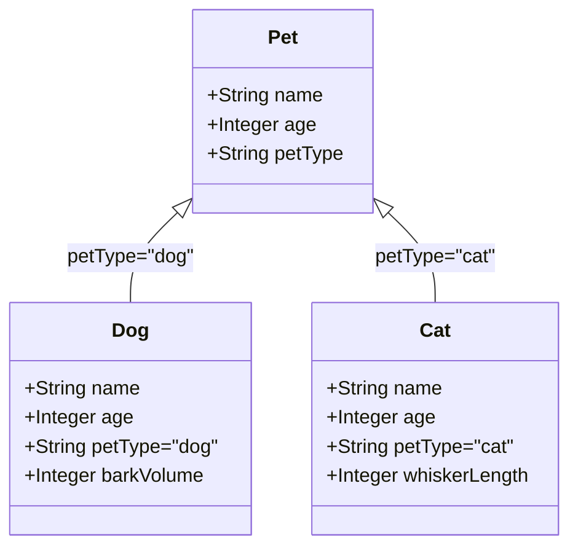
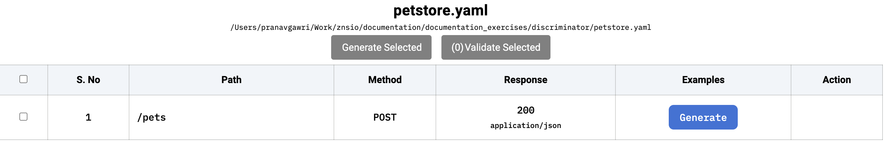
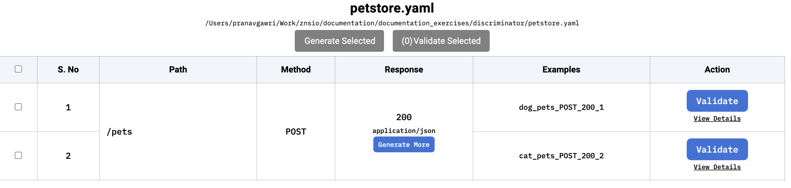

# Discriminator Support in Specmatic

> **Note**: For best support of this feature please use Specmatic version 2.0.41 onwards.

## Overview
OpenAPI's discriminator feature allows APIs to handle polymorphic schemas effectively by specifying how to differentiate between different subtypes of a base schema. Specmatic provides comprehensive support for discriminators across its core functionalities: stubbing, testing, example generation, and backward compatibility checks.

For a detailed understanding of OpenAPI discriminator, refer to the [official OpenAPI documentation](https://spec.openapis.org/oas/v3.0.3#discriminator-object).

## Example Implementation
Here's a visual representation of specification example that we will follow throught this documentation. We can observe how discriminator works here:



The `petType` field acts as the discriminator, determining whether an instance is a Dog or Cat, each with their unique properties while sharing the base Pet properties.
Following is the complete specification that we will follow in this documentation to better understand discriminator support in Specmatic:

```yaml
openapi: 3.0.0
info:
  title: Pet Store API
  version: 1.0.0
paths:
  /pets:
    post:
      requestBody:
        content:
          application/json:
            schema:
              $ref: '#/components/schemas/Pet'
      responses:
        '200':
          description: This is a 200 response.
          content:
            application/json:
              schema:
                $ref: '#/components/schemas/Pet'

components:
  schemas:
    Pet:
      type: object
      discriminator:
        propertyName: petType
        mapping:
          dog: '#/components/schemas/Dog'
          cat: '#/components/schemas/Cat'
      oneOf:
        - $ref: '#/components/schemas/Dog'
        - $ref: '#/components/schemas/Cat'
      
    Pet_base:
      type: object
      properties:
        name:
          type: string
        age:
          type: integer
      required:
        - name
        - age

    Dog:
      allOf:
        - $ref: '#/components/schemas/Pet_base'
        - type: object
          properties:
            petType:
              type: string
              enum: [dog]
            barkVolume:
              type: integer
          required:
            - barkVolume
            - petType

    Cat:
      allOf:
        - $ref: '#/components/schemas/Pet_base'
        - type: object
          properties:
            petType:
              type: string
              enum: [cat]
            whiskerLength:
              type: integer
          required:
            - whiskerLength
            - petType
```

Save this specification in a file named `petstore.yaml`. Now let's walk through how to use Specmatic's features with this specification. 

### 1. Service Virtualization with Discriminator Support
Let's start the Specmatic stub server. To spin up a stub server with the `petstore.yaml` we authored earlier, run below command.


```shell
java -jar specmatic.jar stub petstore.yaml
```


```shell
npx specmatic stub petstore.yaml
```


```shell
docker run -v "/local-directory/petstore.yaml:/usr/src/app/petstore.yaml" -p 9000:9000 znsio/specmatic stub "petstore.yaml"
```



This should start your stub server on port 9000 by default as below.

```shell
Loading petstore.yaml
API Specification Summary: petstore.yaml
  OpenAPI Version: 3.0.1
  API Paths: 1, API Operations: 1


Stub server is running on http://0.0.0.0:9000. Ctrl + C to stop.
```


The stub server provides two key functionalities with discriminator support:

1. **Request Validation**: When a request is received, Specmatic:
   - Extracts the `petType` discriminator value
   - Maps it to the correct schema (Dog/Cat)
   - Validates the request body against that specific schema
   
Example - Valid Dog Request:
```bash
curl -X POST http://localhost:9000/pets -H "Content-Type: application/json" \
-d '{
  "name": "Rex",
  "age": 3,
  "petType": "dog",
  "barkVolume": 7
}'
```

Example - Invalid Dog Request (missing required barkVolume):
```bash
curl -X POST http://localhost:9000/pets -H "Content-Type: application/json" \
-d '{
  "name": "Rex",
  "age": 3,
  "petType": "dog"
}'
```
Error Response:
```shell
In scenario "POST /pets. Response: This is a 200 response."
API: POST /pets -> 200

  >> REQUEST.BODY.barkVolume
  
     Key named barkVolume in the contract was not found in the request
```

2. **Response Generation**: For valid requests, Specmatic:
   - Identifies the correct response schema based on the request's discriminator value
   - Generates a response matching that schema
   - Maintains consistency between request and response types

Example - Cat Request and Auto-generated Response:
```bash
curl -X POST http://localhost:9000/pets -H "Content-Type: application/json" \
-d '{
  "name": "Whiskers",
  "age": 5,
  "petType": "cat",
  "whiskerLength": 10
}'
```
Response:
```json
{
  "name": "Whiskers",
  "age": 5,
  "petType": "cat",
  "whiskerLength": 10
}
```

### 2. Contract Testing with Discriminator Awareness
Now, let's run Specmatic's test. To start the test with the `petstore.yaml` we authored earlier, run below command.


```shell
java -jar specmatic.jar test petstore.yaml --testBaseURL=http://localhost:9000
```


```shell
npx specmatic test petstore.yaml --testBaseURL=http://localhost:9000
```


```shell
docker run -v "./petstore.yaml:/usr/src/app/petstore.yaml" znsio/specmatic test petstore.yaml --port=9000 --host=host.docker.internal
```



Specmatic's contract testing with discriminators works in two directions:

1. **Request Generation**: 
   - Creates test requests for each subtype (Dog/Cat)
   - Includes required discriminator property (`petType`)
   - Adds subtype-specific properties (`barkVolume` for Dog, `whiskerLength` for Cat)
   - Tests boundary conditions (missing/invalid discriminator values)

2. **Response Validation**:
   - Verifies response matches the schema corresponding to request's discriminator value
   - Ensures presence of discriminator property in response
   - Validates subtype-specific properties
   - Checks consistency between request and response types

Here are few example requests : 

a. Testing **Valid** Dog Request:
   ```json
   POST /pets
   Content-Type: application/json
   {
     "name": "Rex",
     "age": 3,
     "petType": "dog",
     "barkVolume": 7
   }
   ```

   b. Testing **Valid** Cat Request:
   ```json
   POST /pets
   Content-Type: application/json
   {
     "name": "Whiskers",
     "age": 5,
     "petType": "cat",
     "whiskerLength": 10
   }
   ```

   c. Testing **Invalid** Discriminator Value:
   ```json
   POST /pets
   Content-Type: application/json
   {
     "name": "Invalid",
     "age": 3,
     "petType": "bird",
     "wingspan": 20
   }
   ```

By running the above `test` command against a stub or live server, we will get following test output:
```shell
Tests run: 2, Successes: 2, Failures: 0, Errors: 0
```

### 3. Example Generation

Specmatic provides an interactive example generation interface. Let's start it with:

```bash
specmatic examples interactive --contract-file=petstore.yaml
```

This launches an interactive server and provides a URL [http://localhost:9001/_specmatic/examples](http://localhost:9001/_specmatic/examples). Opening this in your browser shows:



The interface allows you to:
1. Select different operations
2. Generate examples for specific subtypes
3. View example requests and responses

For our Pet Store API, press the **Generate** button, to generates examples for each discriminator type. Following is how the interface would look once the examples are generated:



Please find below, the two examples that got generated

Dog Example:
```json
{
  "http-request": {
    "method": "POST",
    "path": "/pets",
    "headers": {
      "Content-Type": "application/json"
    },
    "body": {
      "name": "Rex",
      "age": 3,
      "petType": "dog",
      "barkVolume": 7
    }
  },
  "http-response": {
    "status": 200,
    "status-text": "OK",
    "headers": {
        "Content-Type": "application/json"
    },
    "body": {
      "name": "Rex",
      "age": 3,
      "petType": "dog",
      "barkVolume": 7
    }
  }
}
```

Cat Example:
```json
{
  "http-request": {
    "method": "POST",
    "path": "/pets",
    "headers": {
      "Content-Type": "application/json"
    },
    "body": {
      "name": "Whiskers",
      "age": 5,
      "petType": "cat",
      "whiskerLength": 10
    }
  },
  "http-response": {
    "status": 200,
    "status-text": "OK",
    "headers": {
        "Content-Type": "application/json"
    },
    "body": {
      "name": "Whiskers",
      "age": 5,
      "petType": "cat",
      "whiskerLength": 10
    }
  }
}
```

### 4. Backward Compatibility
Specmatic also check backward compatibility of discriminator based OpenAPI Specifications. To check backward compatibility you can run the following command:
```bash
specmatic backward-compatibility-check 
```

> **Note**: For complete understanding of backward compatibility please refer [Backward Compatibility User Guide](/documentation/backward_compatibility.html)

Specmatic checks for breaking changes in:
- Discriminator property names
- Mapping configurations
- Subtype schemas
- Required properties

Breaking changes would include:
- Removing or renaming the `petType` discriminator
- Changing mapping values
- Adding required properties to subtypes
- Modifying existing subtype properties

## Best Practices
1. Always specify explicit mappings in the discriminator object
2. Maintain consistent property names across subtypes
3. Use meaningful discriminator values
4. Include examples for each subtype

## References
1. [OpenAPI Discriminator Documentation](https://spec.openapis.org/oas/v3.0.3#discriminator-object)