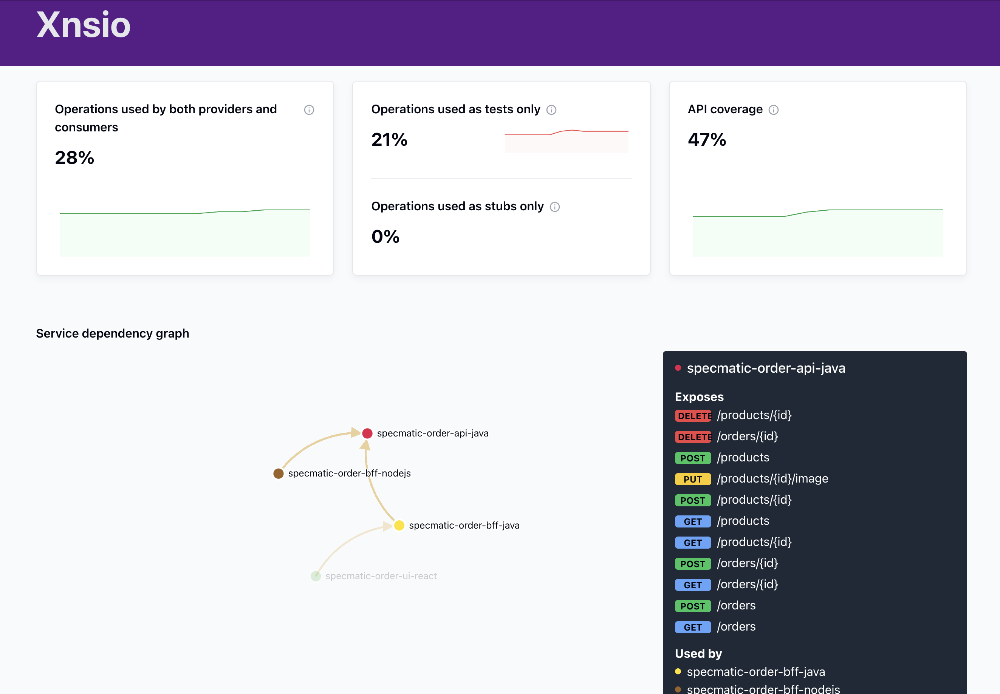
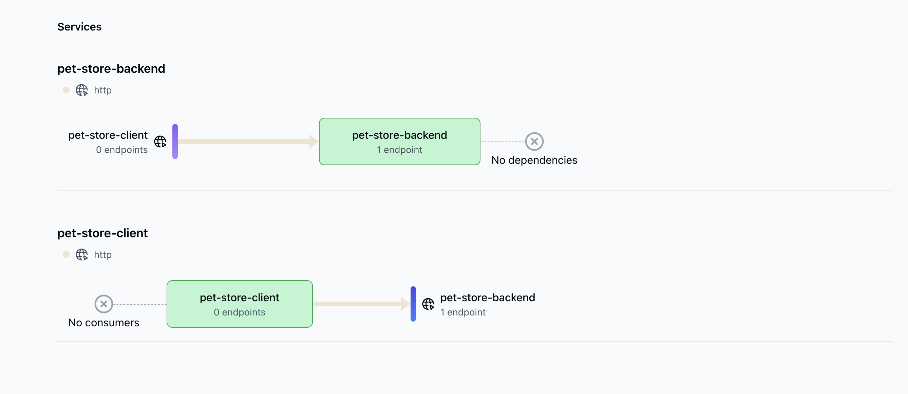

# Specmatic Insights

  - [Introduction](#introduction)
  - [What You will Achieve](#what-you-will-achieve)
  - [Quick Start](#quick-start)
  - [Step 1: Setting Up a Central Contract Repository](#step-1:-setting-up-a-central-contract-repository)
  - [Step 2: Setting up Provider & Consumer services](#step-2:-setting-up-provider-&-consumer-services)
  - [Step 3: Configuring Specmatic Insights](#step-3:-configuring-specmatic-insights)
  - [Step 4: Visualizing Your API Ecosystem](#step-4:-visualizing-your-api-ecosystem)
  - [Troubleshooting](#troubleshooting)

## Introduction

Specmatic Insights is a powerful tool that aggregates Specmatic reports from various environments such as your CI/CD pipelines and visualizes how your organization's microservices interact with each other. This guide will walk you through the setup process and help you leverage the full potential of Specmatic Insights.

### Features

Specmatic Insights offers several key features:

- View your service dependency graph in real-time as your CI builds run
- Track CDD (Contract-Driven Development) adoption progress in your organization
- Identify dependencies between services
- Monitor API coverage and stub usage of your services

To know more about Specmatic Insights, visit [Insights page](https://insights.specmatic.io/).

## What You will Achieve

By the end of this tutorial, you'll have:

1. A central repository for your API contracts
2. CI pipelines for both API providers and consumers using Specmatic
3. A clear visualization of your API ecosystem with Specmatic Insights

Let's get started!

## Quick Start

For those eager to jump in, here's a quick overview of the steps we'll cover:

1. Set up a central contract repository
2. Setting up Provider & Consumer services
3. Configure Specmatic Insights
4. Visualize your API ecosystem

Now, let's dive into the details.

## Step 1: Setting Up a Central Contract Repository

A central contract repository is crucial for maintaining consistency across your API specifications and enabling effective contract testing. Here's how to set it up:

1. Create a new Git repository named "api-contracts".
2. In this repository, create a folder structure to organize your OpenAPI specifications. For example:
      ```
      api-contracts/
      ├── petstore/
      │   └── service.yaml
      └── other-services/
          
      ```
3. Add the following OpenAPI specification "service.yaml" to this repository.

    ```
    openapi: 3.0.1
    info:
      title: Contract for the petstore service
      version: '1'
    paths:
      /pets/{petid}:
        get:
          summary: Should be able to get a pet by petId
          parameters:
            - name: petid
              in: path
              required: true
              schema:
                type: number
              examples:
                SCOOBY_200_OK:
                  value: 1
          responses:
            '200':
              description: Should be able to get a pet by petId
              content:
                application/json:
                  schema:
                    required:
                      - id
                      - name
                      - status
                      - type
                    properties:
                      id:
                        type: number
                      name:
                        type: string
                      type:
                        type: string
                      status:
                        type: string
                  examples:
                    SCOOBY_200_OK:
                      value:
                        id: 1
                        name: Scooby
                        type: Golden Retriever
                        status: Adopted
      ```
4. Set up a simple CI pipeline to lint and check backward compatibility of your contracts using Specmatic:

    ```
    name: Lint specifications and check Backward Compatibility

    on:
      push:
        branches: [ "main" ]
      pull_request:
        branches: [ "main" ]
    jobs:
      run-lint:
        runs-on: ubuntu-latest
        steps:
          - name: Checkout code
            uses: actions/checkout@v4
            with:
              fetch-depth: 0

          - name: Set up Node.js
            uses: actions/setup-node@v2
            with:
              node-version: '14'

          - name: Install OpenAPI linter
            run: npm install -g @stoplight/spectral-cli

          - name: Lint OpenAPI specs
            run: spectral lint **/*.yaml

          - name: Run OpenAPI Backward Compatibility Check using Specmatic
            run: |
              docker run --rm \
              -v "${{ github.workspace }}:/api-contracts:rw" \
              -w /api-contracts \
              --entrypoint /bin/sh \
              znsio/specmatic \
              -c "git config --global --add safe.directory /api-contracts && java -jar /usr/src/app/specmatic.jar backwardCompatibilityCheck"
    ```
## Step 2: Setting up Provider & Consumer services

Now that we have our OpenAPI specification checked in, let's bring our Pet Store to life! We'll create two services: a backend (provider) that serves the API, and a client (consumer) that uses it. 

### 2.1: Setting Up the Pet Store Backend (Provider)

Let's start by creating our pet-store-backend service. Based on the `service.yaml` specification you can create a simple service in any language of your choice. Once it's up & running and pushed into a git repository, we can create the following CI pipeline to test with Specmatic docker image.

      
      name: Java CI with Gradle

      on:
        push:
          branches: [ "main" ]
        pull_request:
          branches: [ "main" ]

      jobs:
        build:

          runs-on: ubuntu-latest
          permissions:
            contents: read

          steps:
          - uses: actions/checkout@v4
            with:
              submodules: 'true'
              
          - name: Set up JDK 17
            uses: actions/setup-java@v4
            with:
              java-version: '21'
              distribution: 'temurin'

          - name: Setup Gradle
            uses: gradle/actions/setup-gradle@af1da67850ed9a4cedd57bfd976089dd991e2582 # v4.0.0

          - name: Validate Gradle wrapper
            uses: gradle/wrapper-validation-action@v1

          - name: Start Spring Boot application
            run: ./gradlew bootRun &

          - name: Wait for application to start
            run: sleep 30

          - name: Contract Test using Specmatic
            run: docker run -v "./specmatic.yaml:/usr/src/app/specmatic.yaml" -e HOST_NETWORK=host --network=host "znsio/specmatic" test --port=8080 --host=localhost

### Step 2.2: Setting Up the Pet Store Client (Consumer)

Now, based on the specification `services.yaml` create a simple client that will consume our Pet Store API. Once it's up & running and pushed into a git repository, we can create the following CI pipeline to Virtualize the API (provider) with Specmatic docker image

      name: Client Contract Test

      on:
        push:
          branches: [ main ]
        pull_request:
          branches: [ main ]

      jobs:
        test:
          runs-on: ubuntu-latest

          steps:
          - uses: actions/checkout@v3

          - name: Use Node.js
            uses: actions/setup-node@v3
            with:
              node-version: '18'

          - name: Install dependencies
            run: npm ci

          - name: Run Specmatic stub
            run: |
              docker run -d --name specmatic-stub \
                -v "${{ github.workspace }}/specmatic.yaml:/usr/src/app/specmatic.yaml" \
                -p 9000:9000 \
                znsio/specmatic stub
              # Wait for the stub to be ready
              sleep 10

          - name: Run contract test
            run: npm run test:contract
            env:
              STUB_URL: http://localhost:9000

## Step 3: Configuring Specmatic Insights

### Setting Up Specmatic Insights

To start using Specmatic Insights:

1. Visit [insights.specmatic.io](https://insights.specmatic.io)
2. Go to the [registration section](https://insights.specmatic.io/dashboard/register)
3. Fill in your email and password, then click "Register".
4. Once registered, you'll have access to your Specmatic Insights dashboard. At the moment you won't see anything here.

### Integrating with CI/CD Pipelines

To get the most out of Specmatic Insights, you need to integrate it into your CI/CD pipelines. Follow these steps for both your provider and consumer services pipelines:

1. As explained in above steps, ensure Specmatic is present in your provider & consumer CI pipelines, helping 'test', in case of provider, and 'virtualize' in case of client.
2. Then, add the 'Specmatic Insights GitHub Build Reporter' to both your consumer and provider CI workflow, after specmatic has run:

```yaml

- name: Run Specmatic Insights Github Build Reporter
  uses: znsio/specmatic-insights-build-reporter-github-action@v2.0.2
  with:
    github-token: ${{ secrets.SPECMATIC_GITHUB_TOKEN }}
    specmatic-insights-host: https://insights.specmatic.io # Or your on-prem URL
    specmatic-reports-dir: ./build/reports/specmatic # Or your custom path
    org-id: YOUR_SPECMATIC_ORG_ID # Replace with your actual Org ID
    branch-ref: ${{ github.ref }}
    branch-name: ${{ github.ref_name }}
    build-id: ${{ github.run_id }}
    repo-name: ${{ github.event.repository.name }}
    repo-id: ${{ github.repository_id }}
    repo-url: ${{ github.event.repository.html_url }}

```

For more details refer  to the [Specmatic Insights GitHub Action documentation](https://github.com/znsio/specmatic-insights-build-reporter-github-action)

Make sure to replace `YOUR_SPECMATIC_ORG_ID` with your actual organization ID. This you can find on your insights dashboard, under settings > general.

## Step 4: Visualizing Your API Ecosystem

### Viewing Your Service Mesh

Once your CI/CD pipelines are set up and have run, you can view your service mesh on the Specmatic Insights dashboard:

1. Log in to your Specmatic Insights account.
2. Navigate to the main dashboard.
3. You should see a visualization of your services and their dependencies.

For example, if you've been following the Petstore example from [Getting Started](https://specmatic.io/getting_started.html), your service mesh might look like this:



### Understanding the Dashboard

The Specmatic Insights dashboard provides several key pieces of information:

- **Service Dependency Graph**: Shows how your services are interconnected.
- **API Coverage**: Indicates how much of your API is covered by tests and contracts.
- **Operations Usage**: Breaks down operations used by both providers and consumers, as tests only, and as stubs only.

Here's an example of what you might see if you have followed the instructions and have been able to setup insights



## Troubleshooting

If you're not seeing your services on the dashboard:

1. Ensure your CI/CD pipelines are correctly set up with the Specmatic Insights Build Reporter.
2. Check that your `org-id` is correct in the GitHub action configuration.
3. Verify that your Specmatic reports are being generated in the specified directory. (./build/reports/specmatic)

For further assistance, please contact [Specmatic support](https://specmatic.io/contact-us/).