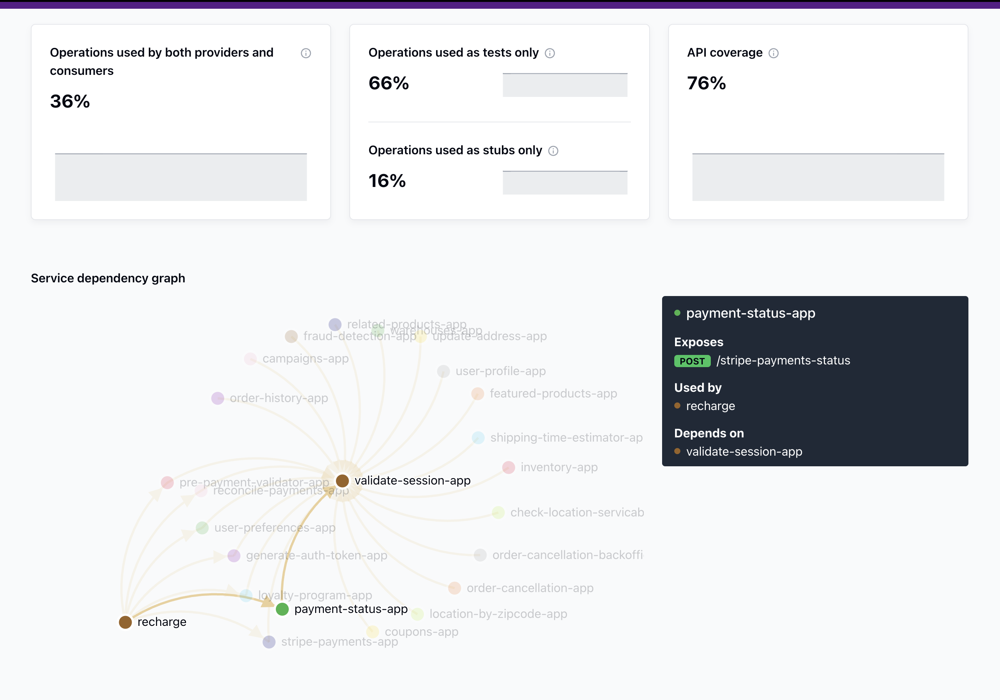
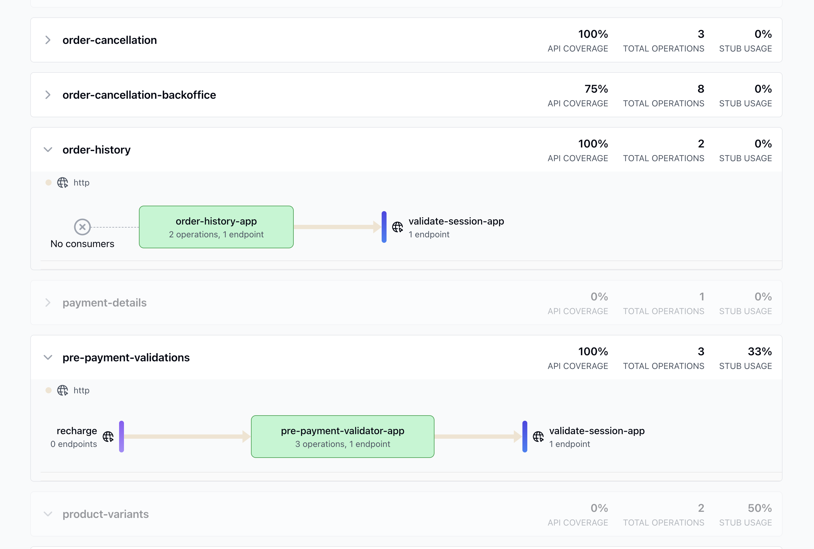
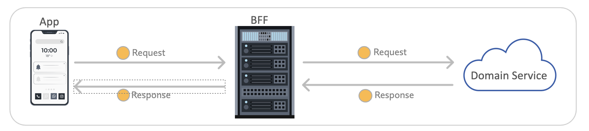

# Specmatic Insights

  - [Introduction](#introduction)
  - [What You will Achieve](#what-you-will-achieve)
  - [Step 1: Setting Up a Central Contract Repository](#step-1-setting-up-a-central-contract-repository)
  - [Step 2: Setting up Client, Provider & Consumer services](#step-2-setting-up-client-provider-and-domain-services)
  - [Step 3: Configuring Specmatic Insights](#step-3-configuring-specmatic-insights)
  - [Step 4: Visualizing Your API Ecosystem](#step-4-visualizing-your-api-ecosystem)
  - [Next Steps](#next-steps)
  - [Troubleshooting](#troubleshooting)

## Introduction

Specmatic Insights is a powerful tool that aggregates Specmatic reports from various environments such as your CI/CD pipelines and visualizes how your organization's microservices, microfrontends & clients interact with each other. This guide will walk you through the setup process and help you leverage the full potential of Specmatic Insights.

### Features

Specmatic Insights offers several key features:

- View your service dependency graph in real-time as your CI builds run
- Track CDD (Contract-Driven Development) adoption progress in your organization
- Identify dependencies between services
- Monitor API coverage and stub usage of your services

Here are some examples of what you can expect to see in Specmatic Insights:



Additionally, the dashboard provides a comprehensive overview of your API ecosystem, offering valuable insights such as:

- Identify circular dependencies in your service architecture
- Pinpoint single points of failure or congestion points in your architecture
- The proportion of operations used by both providers and consumers
- Operations used exclusively for testing and stubbing
- Overall API coverage



To know more about Specmatic Insights, visit [Insights page](https://insights.specmatic.io/).

## What You will Achieve

By the end of this tutorial, you'll have:

1. A central repository for your API contracts
2. CI pipelines for both API providers and consumers using Specmatic
3. A clear visualization of your API ecosystem with Specmatic Insights

Let's get started!

## Step 1: Setting Up a Central Contract Repository

### Setup overview

A central contract repository is crucial for maintaining consistency across your API specifications and enabling effective contract testing. In this tutorial, we'll be working with a typical scenario of microservices & microfrontends involving a Backend-for-Frontend (BFF) and a Domain Service. Here's an overview of what we'll be setting up:



In this architecture:

The App represents the client application (e.g., a mobile app or web frontend)
The BFF (Backend-for-Frontend) acts as an intermediary, tailoring the API for the specific client needs
The Domain Service represents the core business logic and data management

We'll be working with two OpenAPI specifications:

* `order_bff.yaml:` Implemented by the BFF services, this specification defines the API contract for clients (like the mobile app).
* `order_api.yaml:` Implemented by the Domain Service, this specification defines the API contract for BFFs.

### Setting up the central contract repository

1. Create a new Git repository named "api-contracts".
2. In this repository, create a folder structure to organize your OpenAPI specifications. For our example, we will do it as follows:

      ```
      api-contracts/
      ├── orders/
      │   ├── order_bff.yaml
      │   └── order_api.yaml
      └── other-services/
          
      ```
3. Download and add the following OpenAPI specifications to the repository as depicted above

    - [Order BFF OpenAPI Spec](insights_tutorial_spec_files/order_bff.yaml)
    - [Order Domain API OpenAPI Spec](insights_tutorial_spec_files/order_api.yaml)

4. Set up a simple CI pipeline to perform the following actions on OpenAPI specs in the central contract repo:
* lint 
* check backward compatibility of your contracts using Specmatic
* generate insights report, using specmatic docker image
* run specmatic insights build reporter

    ```yaml
    
    name: Lint specifications and check Backward Compatibility

    on:
      push:
        branches: [ "main" ]
      pull_request:
        branches: [ "main" ]
    jobs:
      run-lint:
        runs-on: ubuntu-latest
        steps:
          - name: Checkout code
            uses: actions/checkout@v4
            with:
              fetch-depth: 0

          - name: Set up Node.js
            uses: actions/setup-node@v2
            with:
              node-version: '14'

          - name: Install OpenAPI linter
            run: npm install -g @stoplight/spectral-cli

          - name: Lint OpenAPI specs
            run: spectral lint **/*.yaml

          - name: Run OpenAPI Backward Compatibility Check using Specmatic
            run: |
              docker run --rm \
              -v "${{ github.workspace }}:/api-contracts:rw" \
              -w /api-contracts \
              --entrypoint /bin/sh \
              znsio/specmatic \
              -c "git config --global --add safe.directory /api-contracts && java -jar /usr/src/app/specmatic.jar backwardCompatibilityCheck"
          
          - name: Generate central contract repo report
            run: |
              docker run -v "$(pwd):/central-contract-repo:rw" \
                --entrypoint /bin/sh znsio/specmatic \
                -c "cd /central-contract-repo && java -jar /usr/src/app/specmatic.jar central-contract-repo-report"
          
          - name: Run Specmatic Insights Github Build Reporter
            uses: znsio/specmatic-insights-build-reporter-github-action@v2.0.2
            with:
              github-token: ${{ secrets.GH_REPOSITORY_TOKEN }}
              org-id:  YOUR_SPECMATIC_ORG_ID # Replace with your actual Org ID
              branch-ref: ${{ github.ref }}
              branch-name: ${{ github.ref_name }}
              build-id: ${{ github.run_id }}
              repo-name: ${{ github.event.repository.name }}
              repo-id: ${{ github.repository_id }}
              repo-url: ${{ github.event.repository.html_url }} 
      
    ```
    
<!-- After successfully setting up your central contract repository and running the CI pipeline, you should see output similar to this:

[Successful contract repo](../images/step1_successful) -->

## Step 2: Setting up Client, Provider and Domain services

Now that we have our OpenAPI specification checked in, let's bring our Order services to life! 

**Client** - You can implement client in programming language of your choice. Once ready, place the following configuration in a file name `specmatic.yaml` at the root level of your project, this will:
* virtualize BFF service for the client application (based on the `order_bff.yaml` contract), helping isolate the client.

 ```yaml
 sources:
  - provider: git
    repository: (your-git-repository)
    stub:
      - path/to/your/spec/in/git/order_bff.yaml # BFF service contract
 ```

**BFF Service** - Implement BFF service in language of your choice. Once ready, place the following configuration in a file name `specmatic.yaml` at the root level of your project. This will :
* virtualize Domain API service for the BFF application (based on `order_api.yaml` contract)
* and test the BFF service as client (using the `order_bff.yaml` contract)


```yaml
sources:
  - provider: git
    repository: (your-git-repository)
    test:
      - path/to/your/spec/in/git/order_bff.yaml # BFF service contract
    stub:
      - path/to/your/spec/in/git/order_api.yaml # Domain service contract
```

**Domain Service** - After implementing domain service, place the following configuration in a file named `specmatic.yaml` at the root level of your project. This will test the domain API based on the `order_api.yaml` contract.

```yaml
sources:
  - provider: git
    repository: (your-git-repository)
    test:
      - path/to/your/spec/in/git/order_api.yaml # Domain service contract
```


### 2.1: Setting Up CI pipeline for client

After the client is up and running and checked in to a git repository, we can create the following CI pipeline to :
* build the client app
* virtualize BFF service using `order_bff.yaml` and **Specmatic** docker image.
* test client implementation against the virtualized BFF service.

(note: we implemented the client in react, so setting up pipeline accordingly)

```yaml
name: Client Contract Test

on:
  push:
    branches: [ main ]
  pull_request:
    branches: [ main ]

jobs:
  test:
    runs-on: ubuntu-latest

    steps:
    - uses: actions/checkout@v3

    - name: Use Node.js
      uses: actions/setup-node@v3
      with:
        node-version: '18'

    - name: Install dependencies
      run: npm ci

    - name: Run Specmatic stub to virtualize the BFF service
      run: |
        docker run -d --name specmatic-stub \
          -v "${{ github.workspace }}/specmatic.yaml:/usr/src/app/specmatic.yaml" \
          -p 8080:8080 \
          znsio/specmatic stub

        # Wait for the stub to be ready
        sleep 10

    - name: Run component test against the Specmatic stub
      run: npm run test:component
      env:
        STUB_URL: http://localhost:8080
```

<!-- Upon successful execution of the client CI pipeline, you should see output resembling this:

[Successful Client CI Pipeline](../images/successful_client_ci_pipe) -->

### Step 2.2: Setting up CI pipeline for BFF Service

Make sure BFF service is checked in to a git repository. Then create the following CI pipeline to :
* build the BFF service
* virtualize Domain service using `order_api.yaml` and **Specmatic** docker image.
* test BFF service using `order_bff.yaml` and **Specmatic** docker image. 

(note: we implemented the BFF service in Kotlin, so setting up pipeline accordingly)

```yaml
name: BFF Service (Kotlin) CI with Gradle 

on:
  push:
    branches: [ "main" ]
  pull_request:
    branches: [ "main" ]

jobs:
  build:
    runs-on: ubuntu-latest
    permissions:
      contents: read

    steps:
    - uses: actions/checkout@v4
      with:
        submodules: 'true'
        
    - name: Set up JDK 17
      uses: actions/setup-java@v4
      with:
        java-version: '21'
        distribution: 'temurin'

    - name: Setup Gradle
      uses: gradle/actions/setup-gradle@af1da67850ed9a4cedd57bfd976089dd991e2582 # v4.0.0

    - name: Validate Gradle wrapper
      uses: gradle/wrapper-validation-action@v1

    - name: Run Specmatic stub to virtualize the Order API service
      run: |
        docker run -d --name specmatic-stub \
          -v "${{ github.workspace }}/specmatic.yaml:/usr/src/app/specmatic.yaml" \
          -p 9000:9000 \
          znsio/specmatic stub

        # Wait for the stub to be ready
        sleep 10

    - name: Start Spring Boot application
      run: ./gradlew bootRun &

    - name: Wait for application to start
      run: sleep 30

    - name: Contract Test BFF service using Specmatic
      run: docker run -v "./specmatic.yaml:/usr/src/app/specmatic.yaml" -e HOST_NETWORK=host --network=host "znsio/specmatic" test --port=8080 --host=localhost
```

<!-- After running the BFF service CI pipeline, you should see results similar to:

[Successful BFF CI pipeline](../images/success_bff_ci_pipe) -->

### Step 2.3: Setting up CI pipeline for Order API

Make sure Order Domain API service is checked in to a git repository. Then create the following CI pipeline to :
* build the Domain API service
* test Domain API service using `order_api.yaml` and **Specmatic** docker image. 

(note: we implemented the Order Domain API service in Kotlin, so setting up pipeline accordingly)

```yaml
name: Domain API service CI with gradle

on:
  push:
    branches: [ "main" ]
  pull_request:
    branches: [ "main" ]

jobs:
  build:
    runs-on: ubuntu-latest
    permissions:
      contents: read

    steps:
    - uses: actions/checkout@v4
      with:
        submodules: 'true'
        
    - name: Set up JDK 17
      uses: actions/setup-java@v4
      with:
        java-version: '21'
        distribution: 'temurin'

    - name: Setup Gradle
      uses: gradle/actions/setup-gradle@af1da67850ed9a4cedd57bfd976089dd991e2582 # v4.0.0

    - name: Validate Gradle wrapper
      uses: gradle/wrapper-validation-action@v1

    - name: Start Spring Boot application
      run: ./gradlew bootRun &

    - name: Wait for application to start
      run: sleep 30

    - name: Contract Test Domain API service using Specmatic
      run: docker run -v "./specmatic.yaml:/usr/src/app/specmatic.yaml" -e HOST_NETWORK=host --network=host "znsio/specmatic" test --port=9000 --host=localhost
```

<!-- Upon completion of the Order API CI pipeline, you should see output like this:

[Success Order API CI pipeline](../images/success_order_api_ci_pipe) -->

### Summary of Progress

Congratulations! At this point, you have successfully set up and configured:

✅ Central contract repository with CI/CD for linting and backward compatibility checks <br>
✅ Client application with CI/CD for building and testing against a virtualized BFF service <br>
✅ BFF service with CI/CD for building, testing against a virtualized Domain service, and being tested as a provider <br>
✅ Domain service with CI/CD for building and being tested as a provider <br>

All four components are now integrated with Specmatic for contract testing and service virtualization. This setup ensures that your entire API ecosystem is continuously validated and maintains consistency across all services.
With this foundation in place, we can now move on to configuring Specmatic Insights to visualize and analyze your API ecosystem.

## Step 3: Configuring Specmatic Insights

### Setting Up Specmatic Insights

To start using Specmatic Insights please contact [Specmatic support](https://specmatic.io/contact-us/). We will create an account and setup your dashboard.

### Integrating with CI/CD Pipelines

To get the most out of Specmatic Insights, you need to integrate it into your CI/CD pipelines. Follow these steps for your Client, BFF Service & Order Domain API service

1. As explained in above steps, ensure Specmatic is present in your CI pipelines, helping 'test' and 'virtualize'. 
2. Then, add the 'Specmatic Insights GitHub Build Reporter' to your CI pipelines after specmatic has run on all of the following:
2.1 client
2.2 BFF service
2.3 and Order API CI workflow

```yaml

- name: Run Specmatic Insights Github Build Reporter
  uses: znsio/specmatic-insights-build-reporter-github-action@v2.0.2
  with:
    github-token: ${{ secrets.SPECMATIC_GITHUB_TOKEN }}
    specmatic-insights-host: https://insights.specmatic.io # Or your on-prem URL
    specmatic-reports-dir: ./build/reports/specmatic # Or your custom path
    org-id: YOUR_SPECMATIC_ORG_ID # Replace with your actual Org ID
    branch-ref: ${{ github.ref }}
    branch-name: ${{ github.ref_name }}
    build-id: ${{ github.run_id }}
    repo-name: ${{ github.event.repository.name }}
    repo-id: ${{ github.repository_id }}
    repo-url: ${{ github.event.repository.html_url }}

```

For more details refer to the [Specmatic Insights GitHub Action documentation](https://github.com/znsio/specmatic-insights-build-reporter-github-action)

Make sure to replace `YOUR_SPECMATIC_ORG_ID` with your actual organization ID. This you can find on your insights dashboard, under settings > general.

## Step 4: Visualizing Your API Ecosystem

### Viewing Your Service Mesh

Once your CI/CD pipelines are set up and have run, you can view your service mesh on the Specmatic Insights dashboard:

1. Log in to your Specmatic Insights account.
2. Navigate to the main dashboard.
3. You should see a visualization of your services and their dependencies.

For example, if you've been following the Order example, your service mesh might look like this:


### Understanding the Dashboard

The Specmatic Insights dashboard provides several key pieces of information:

- **Service Dependency Graph**: Shows how your services are interconnected.
- **API Coverage**: Indicates how much of your API is covered by tests and contracts.
- **Operations Usage**: Breaks down operations used by both providers and consumers, as tests only, and as stubs only.

Here's an example of what you might see if you have followed the instructions and have been able to setup insights


## Next Steps

Congratulations! You've set up a powerful system for managing and visualizing your APIs. Here are some next steps to consider:

Integrate more of your services into this ecosystem.
Use the insights gained to identify areas for improvement in your API design and usage.
Leverage Specmatic for contract-driven API development.

## Troubleshooting

If you're not seeing your services on the dashboard:

1. Ensure your CI/CD pipelines are correctly set up with the Specmatic Insights Build Reporter.
2. Check that your `org-id` is correct in the GitHub action configuration.
3. Verify that your Specmatic reports are being generated in the specified directory. (./build/reports/specmatic)

For further assistance, please contact [Specmatic support](https://specmatic.io/contact-us/).