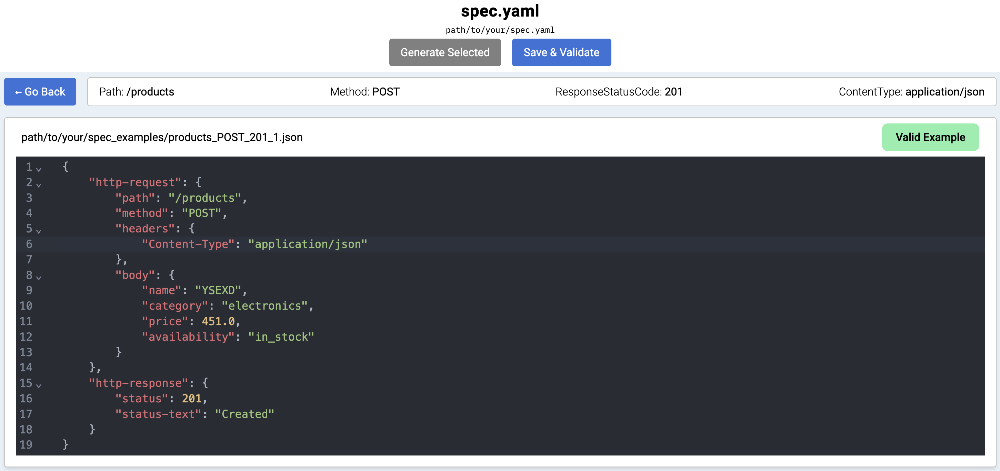
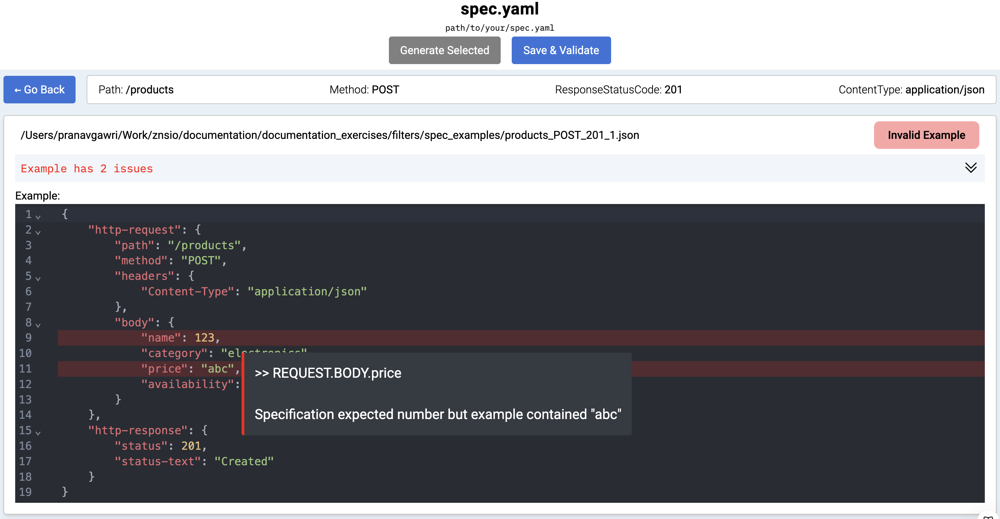
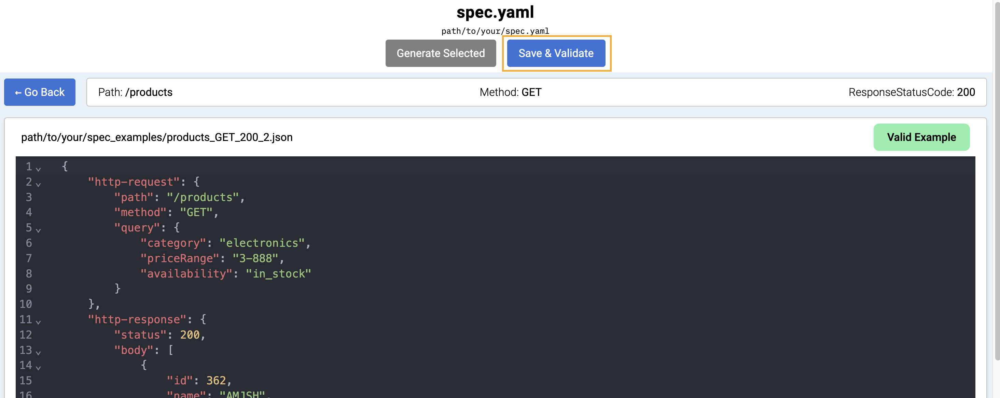

# Interactive Examples

  - [Introduction](#introduction)
  - [Inline examples editor](#inline-examples-editor)
  

# Inline examples editor

## Overview
Specmatic reimagines contract testing with its innovative Inline GUI Editor, a feature designed to transform how teams maintain their test examples. Moving beyond traditional text-based editing, this integrated environment combines real-time validation with an intuitive interface, making example management a seamless part of your contract testing workflow.

## Why Inline GUI Editor?
Traditional contract testing tools often treat examples as static files, requiring constant switching between editors, validators, and testing environments. Specmatic's Inline GUI Editor transforms this experience by:

- Unifying example management within your testing workflow
- Providing immediate feedback on specification compliance
- Eliminating the need for external JSON editors
- Reducing the time spent on example maintenance

## Features

### Smart Example Viewer
The editor elevates JSON viewing with context-aware syntax highlighting and intelligent formatting, making even complex examples easily digestible.



### Comprehensive Validation

#### Specification Validation
The editor performs thorough validation against your API specification:

1. **Data Type Validations**
   - Type mismatches (strings vs numbers vs booleans)
   - Format validations (dates, URLs, emails)
   - Enum value validations
   - Discriminator mapping validations
   - Complex type validations (oneOf, allOf)

2. **Structural Validations**
   - Required field presence
   - Unwanted/extra field detection
   - Array validations (empty arrays, duplicates)
   - Object nesting validation

3. **Constraint Validations**
   - Numeric range checks
   - String length limits
   - Date sequence logic (e.g., start date before end date)
   - Nullable field handling
   - Pattern matching

#### Linting Validation
The editor catches JSON syntax and formatting issues:

1. **Syntax Validation**
   - Bracket and brace matching
   - Comma placement
   - Colon usage
   - Quote matching
   - Special character escaping

2. **Format Validation**
   - Key formatting
   - Value formatting
   - Whitespace usage
   - Indentation consistency

### Common Validation Scenarios

#### Specification Validation Examples

```yaml
{
    "id": "123",              // Error: Type mismatch - number expected
    "severity": "Extreme",    // Error: Invalid enum value
    "creationDate": "invalid",// Error: Invalid date format
    "extraField": "value",    // Error: Undefined field in schema
    "requiredField": null     // Error: Non-nullable field
}
```

#### Linting Validation Examples

```yaml
{
    "id": 123
    "name": 'invalid quotes', // Error: Invalid quote usage
    key-without-quotes: "v",  // Error: Unquoted key
    "": "empty-key",         // Error: Empty key
    "value": ,              // Error: Invalid value
}
```

### Visual Error Indicators
- Critical specification errors: Red highlighting
- Linting warnings: Yellow highlighting
- Hover tooltips with:
  - Error description
  - Expected vs actual value
  - Resolution suggestions



### Validation Controls
Strategic placement of controls streamlines the validation workflow:
- **Save & Validate**: One-click validation against your specification



## Working with the Editor

### Complete Validation Checklist

#### Specification Validation Checks
- [ ] Data Type Mismatches
  - [ ] String vs Number
  - [ ] Boolean vs String
  - [ ] Array vs Object
  
- [ ] Format Violations
  - [ ] Date formats
  - [ ] URL formats
  - [ ] Email formats
  
- [ ] Enum Validations
  - [ ] Value presence in enum list
  - [ ] Case sensitivity
  
- [ ] Discriminator Validations
  - [ ] Mapping correctness
  - [ ] Required fields for type
  
- [ ] Complex Type Validations
  - [ ] allOf constraints
  - [ ] oneOf constraints
  
- [ ] Required Fields
  - [ ] Presence check
  - [ ] Non-null constraints
  
- [ ] Field Constraints
  - [ ] Number ranges
  - [ ] String lengths
  - [ ] Array sizes
  
- [ ] Logical Validations
  - [ ] Date sequences
  - [ ] Dependent fields
  
#### Linting Validation Checks
- [ ] Syntax Elements
  - [ ] Braces and brackets
  - [ ] Commas
  - [ ] Colons
  
- [ ] Key/Value Format
  - [ ] Key validity
  - [ ] Value format
  - [ ] Quote usage
  
- [ ] Special Characters
  - [ ] Proper escaping
  - [ ] Valid Unicode

### Best Practices
- Leverage real-time validation for immediate feedback
- Use hover insights to understand and resolve issues
- Take advantage of the integrated workflow for faster iterations
- Maintain examples within the context of your specifications

### Pro Tips
- Use the editor's real-time feedback to catch issues early
- Take advantage of the integrated validation while making changes
- Let the editor guide you toward specification-compliant examples
- Use the hover tooltips to deepen your understanding of validation rules

---

*Note: The Inline GUI Editor is available in Specmatic version 3.0 and above.